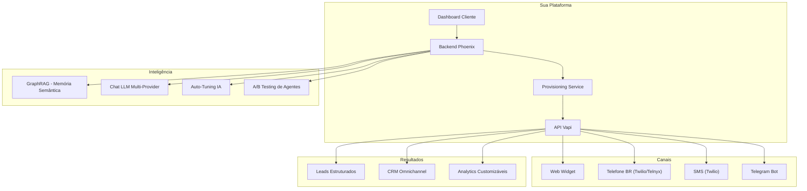
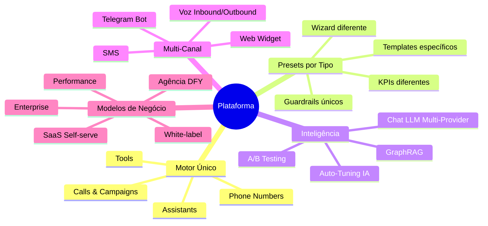

# 1. Visão Geral e Proposta de Valor

[← Índice](README.md) | [Modelos de Negócio →](02_modelos_negocio.md)

---

## 🎯 O que é

Plataforma SaaS multi-tenant para criação e gerenciamento de agentes de voz IA, construída sobre a API da Vapi (Elixir + Phoenix LiveView). Permite que clientes criem, publiquem e monitorem agentes de atendimento, vendas, cobrança e operações com templates por objetivo, **com CRM omnichannel, GraphRAG, automação multi-canal (voz, SMS, Telegram), A/B testing, auto-tuning por IA, compliance LGPD e segurança enterprise**.

> 🧩 **Não são 5 produtos. É 1 produto com 5 presets.**

---

## 💡 Proposta de Valor

### Para empresas (self-serve / no-code)
> "Crie e publique um agente de voz/chat para atendimento, captação e agendamento em minutos, com templates por objetivo, integrações e métricas."

### Para clientes maiores (agência / DFY)
> "Implementamos seu agente pronto pra produção em 7–14 dias: prompts, integrações, QA, telefonia, compliance, monitoramento e otimização."

### Para parceiros (white-label)
> "Sua marca, sua infra. Revenda a plataforma com branding customizado, domínio próprio e billing independente."

---

## 🇧🇷 Posicionamento no Brasil

No Brasil você **não vende "AI Agent"**. Você vende:

| O que o mercado entende | Como comunicar |
|------------------------|----------------|
| Atendimento automático | "Secretária virtual 24h" |
| Captação de leads | "Nunca mais perder ligação" |
| SDR automático | "Vendedor que liga sozinho" |
| Agendamento | "Agenda automática sem WhatsApp" |
| Redução de custo | "Menos recepcionista, mais resultado" |
| Cobrança automatizada | "Recupere inadimplentes com IA" |

---

## 🏗️ Conceito Arquitetural

> **Regra**: O cliente **nunca** fala direto com a Vapi. Tudo passa pelo seu backend.

---

## 🌍 Mercado Brasileiro

### ✅ Oportunidades
- WhatsApp e telefone dominantes
- Atendimento ruim na maioria das empresas
- Falta de automação real
- Mão de obra cara para atendimento
- Alta demanda por agendamento
- Cobrança automatizada em alta demanda

### ⚠️ Desafios
- Sensibilidade a preço
- Infra de telefonia mais cara que EUA
- Cultura ainda aprendendo IA
- Empresas pequenas com pouco processo
- Compliance LGPD obrigatório

---

## 🔥 Diferencial Competitivo

| Concorrentes | Você |
|-------------|------|
| Template genérico | Templates por nicho BR |
| Sem métricas | Dashboard de ROI claro + Analytics customizáveis |
| "Configure sozinho" | Plataforma + Implementação |
| Sem QA | Evals automáticos por versão |
| Canal único (voz) | Multi-canal: voz + SMS + Telegram + web |
| Sem memória | CRM omnichannel + GraphRAG (memória de longo prazo) |
| Prompt fixo | A/B testing + auto-tuning por IA |
| Sem compliance | LGPD data portability + audit trail forense |

> **Tese**: "Não é só 'um prompt' — é um sistema com QA, memória semântica, multi-canal e métricas."

---

## 🧠 Mentalidade

---

## 📊 Capacidades da API Vapi (o que você pode construir)

| Recurso | Descrição |
|---------|-----------|
| Assistentes | Criar, atualizar, configurar LLM/voz/prompt/tools |
| Telefonia | Números BR (Twilio/Telnyx), inbound/outbound, WebRTC |
| Tools | Function calling, code tools, transfer, end call, query (RAG) |
| Squads | Multi-agente, handoff, roteamento |
| Analytics | Logs, call logs, scorecards, insights |
| Evals | Testes automatizados, LLM judge |
| Chat | Chat API, streaming, SMS |
| Knowledge Base | Upload de arquivos, RAG, extração estruturada |
| Workflows | Fluxos visuais com condições e rotas |
| Vozes | Catálogo + clonagem de voz (ElevenLabs) |
| Segurança | HIPAA, PCI, JWT, credenciais externas |

---

## 🔐 Segurança e Compliance

| Feature | Descrição |
|---------|-----------|
| 2FA (TOTP) | Autenticação de dois fatores com QR Code |
| Device Tracker | Fingerprinting de navegador (CPU, RAM, screen) |
| Keystroke Rhythm | Biometria comportamental por digitação |
| Magic Link | Login sem senha por email |
| OAuth Social | Google + GitHub login |
| API Keys | Chaves por tenant com escopos |
| Audit Trail | 90+ ações auditadas com JSONB |
| LGPD | Data portability (export JSON/CSV) |
| Rate Limiting | Hammer ETS por contexto |
| Sudo Mode | Re-autenticação em rotas sensíveis |
| IP Whitelist | Blacklist por CIDR |
| Maintenance Mode | 503 com branding dinâmico |

---

[← Índice](README.md) | [Modelos de Negócio →](02_modelos_negocio.md)
