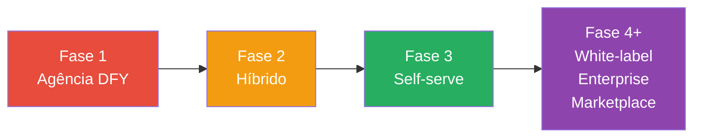
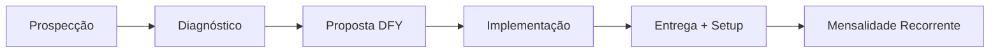
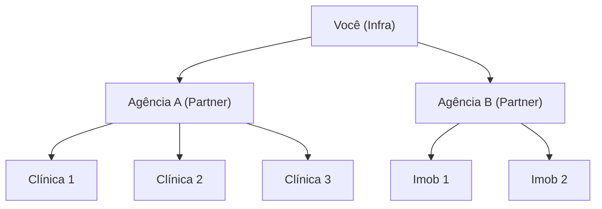

# 2. Modelos de Negócio

[← Visão Geral](01_visao_geral.md) | [Índice](README.md) | [Project Types →](03_project_types.md)

---

## 🗺️ Evolução dos Modelos



---

## 📋 Os 10 Modelos

### 1️⃣ Agência First (DFY — Done For You)

| Aspecto | Detalhe |
|---------|---------|
| **O que é** | Vende implementação completa como serviço |
| **Quando** | Meses 1–3 |
| **Receita** | Setup R$ 3k–10k + mensalidade R$ 997–2.500 |
| **Vantagem** | Receita imediata, validação rápida |
| **Risco** | Não escala, depende de você |

**Fluxo**:


---

### 2️⃣ Híbrido (Plataforma + Serviço)

| Aspecto | Detalhe |
|---------|---------|
| **O que é** | Plataforma com serviço de implementação opcional |
| **Quando** | Meses 3–6 |
| **Receita** | SaaS R$ 497–1.997 + setup R$ 2k–5k |
| **Vantagem** | Melhor de dois mundos |
| **Risco** | Complexidade operacional |

---

### 3️⃣ Produto Self-Serve

| Aspecto | Detalhe |
|---------|---------|
| **O que é** | SaaS puro — cliente cria e gerencia sozinho |
| **Quando** | Meses 6–12 |
| **Receita** | Assinatura + consumo |
| **Vantagem** | Escala sem time proporcional |
| **Risco** | Exige produto muito bom + onboarding |

---

### 4️⃣ White-Label / Reseller

| Aspecto | Detalhe |
|---------|---------|
| **O que é** | Parceiros vendem com marca deles |
| **Quando** | Mês 6+ |
| **Receita** | Atacado R$ 400–600/tenant ou comissão 30–40% |
| **Vantagem** | Crescimento exponencial, CAC zero |
| **Risco** | Marca invisível, dependência de parceiros |



---

### 5️⃣ Enterprise

| Aspecto | Detalhe |
|---------|---------|
| **O que é** | Contratos grandes com SLA, customização, segurança |
| **Quando** | Ano 2+ |
| **Receita** | R$ 5k–20k/mês |
| **Vantagem** | Ticket alto, churn baixo |
| **Risco** | Ciclo de vendas longo, exige compliance |

---

### 6️⃣ BYOK/BYOC (Traga Sua Chave/Carrier)

| Aspecto | Detalhe |
|---------|---------|
| **O que é** | Cliente conecta próprias chaves de LLM/telefonia |
| **Quando** | Planos avançados/enterprise |
| **Receita** | Add-on R$ 297/mês |
| **Vantagem** | Reduz seu custo variável |
| **Risco** | Mais complexidade de suporte |

---

### 7️⃣ Marketplace Controlado

| Aspecto | Detalhe |
|---------|---------|
| **O que é** | Marketplace interno de templates, add-ons, conectores |
| **Quando** | Ano 2+ |
| **Receita** | Comissão sobre vendas |
| **Vantagem** | Ecossistema, receita passiva |
| **Risco** | Controle de qualidade |

---

### 8️⃣ Verticalização por Nicho

| Aspecto | Detalhe |
|---------|---------|
| **O que é** | Versões verticalizadas por setor (saúde, jurídico, imob) |
| **Quando** | Após validar 2+ verticais |
| **Receita** | Precificação por nicho |
| **Vantagem** | Diferencial competitivo, pricing premium |
| **Risco** | Fragmentação de produto |

---

### 9️⃣ Cobrança por Resultado (Performance)

| Aspecto | Detalhe |
|---------|---------|
| **O que é** | Cobra por lead gerado, agendamento, recuperação |
| **Quando** | Nichos específicos |
| **Receita** | R$ 15–50/lead + base R$ 997 |
| **Vantagem** | ROI direto, fácil vender |
| **Risco** | Disputas, contestação de lead |

---

### 🔟 Serviços Gerenciados (Managed / BPO)

| Aspecto | Detalhe |
|---------|---------|
| **O que é** | Operação completa terceirizada |
| **Quando** | Clientes enterprise |
| **Receita** | R$ 5k–15k/mês |
| **Vantagem** | Ticket altíssimo |
| **Risco** | Overhead operacional |

---

## 📊 Matriz Comparativa

| Modelo | Receita | Escalabilidade | CAC | Risco | Fase |
|--------|---------|---------------|-----|-------|------|
| Agência DFY | Alta imediata | Baixa | Baixo | Médio | 1 |
| Híbrido | Média | Média | Médio | Médio | 2 |
| Self-serve | Média | Alta | Alto | Médio | 3 |
| White-label | Indireta alta | Muito alta | Muito baixo | Médio | 4 |
| Enterprise | Muito alta | Média | Alto | Baixo | 4 |
| BYOK/BYOC | Add-on | — | — | Baixo | 3 |
| Marketplace | Passiva | Alta | — | Médio | 5 |
| Verticalização | Premium | Alta | Médio | Médio | 3 |
| Performance | Variável | Alta | Baixo | Alto | 3 |
| Managed | Muito alta | Baixa | Baixo | Alto | 4 |

---

## 🧠 Estratégia Híbrida Recomendada

```
Ano 1: 70% direto / 30% parceiros
Ano 2: 50% direto / 50% parceiros
Ano 3: 30% direto / 70% parceiros
```

> O modelo self-serve gera volume; o white-label gera escala; o enterprise gera ticket.

---

[← Visão Geral](01_visao_geral.md) | [Índice](README.md) | [Project Types →](03_project_types.md)
