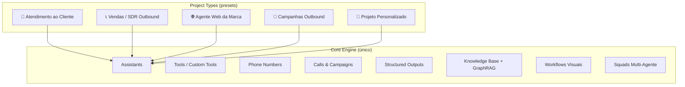
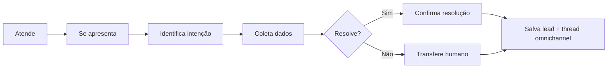
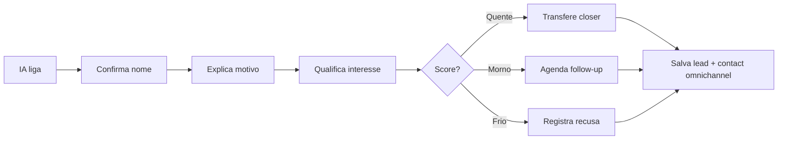
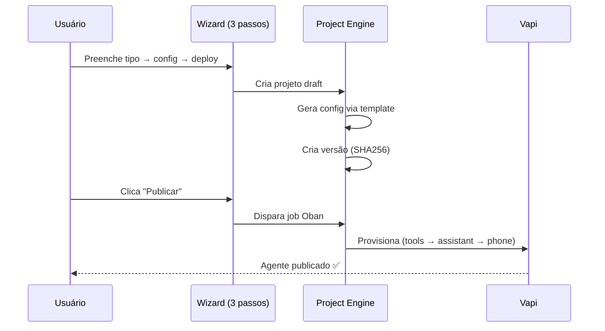

# 3. Project Types e Templates

[← Modelos de Negócio](02_modelos_negocio.md) | [Índice](README.md) | [Casos de Uso →](04_casos_de_uso.md)

---

## 🎯 Conceito Central

> **Não são 5 produtos. É 1 produto com 5 presets.** Cada project type customiza wizard, prompt, tools, structured output e dashboard — tudo no mesmo motor.



---

## 📋 Os 5 Project Types

### 🏥 1. Atendimento ao Cliente (`receptive_support`)

| Aspecto | Detalhe |
|---------|---------|
| **Modo padrão** | 🔒 Travado |
| **Público** | Clínicas, consultórios, barbearias, call centers |
| **Objetivo** | Atender, resolver, escalar se necessário |
| **Wizard** | Nome, horários, FAQ, número de transfer, tom |
| **Canais** | Voz inbound, web widget |

**Fluxo do Agente:**


**Tools provisionados:** Assistant, Structured Output (lead + feedback), Query Tool (FAQ/KB), Transfer Tool, Phone Number BR

**KPIs do Dashboard:** Chamadas atendidas, taxa de resolução, transferências, NPS, custo por atendimento

---

### 📞 2. Vendas / SDR Outbound (`sales_playbook`)

| Aspecto | Detalhe |
|---------|---------|
| **Modo padrão** | 🧠 Avançado |
| **Público** | Seguros, consórcios, imobiliárias, energia solar, educação |
| **Objetivo** | Ligar, qualificar, agendar com closer |
| **Wizard** | Script, lista de leads, horários, classificação A/B/C |
| **Canais** | Voz outbound, SMS follow-up, Telegram |

**Fluxo:**


**Automação integrada:**
- Hot Lead Worker detecta score alto → auto-liga closer em 30s
- A/B testing de scripts para otimizar taxa de conversão
- Auto-tuning por IA analisa chamadas fracas e sugere melhorias

**KPIs:** Taxa de conexão, leads qualificados, transferências, custo por lead, conversão para reunião

---

### 🌐 3. Agente Web da Marca (`brand_web_agent`)

| Aspecto | Detalhe |
|---------|---------|
| **Modo padrão** | 🔒 Travado |
| **Público** | Qualquer empresa que queira atendimento web/telefone |
| **Objetivo** | Atender, responder FAQ, capturar lead |
| **Wizard** | Nome da empresa, tom, FAQ, layout do widget |
| **Canais** | Web widget embeddable, voz inbound |
| **Extra** | Knowledge Base com GraphRAG para respostas mais precisas |

---

### 📢 4. Campanhas Outbound (`outbound_campaigns`)

| Aspecto | Detalhe |
|---------|---------|
| **Modo padrão** | 🧠 Avançado |
| **Público** | Escolas, academias, financeiras, SaaS |
| **Objetivo** | Ligar listas em batch, qualificar, agendar |
| **Multi-canal** | Voz + SMS + Telegram (seleção por campanha) |
| **Features** | Upload CSV, voicemail detection, retry inteligente |

---

### 🔧 5. Projeto Personalizado (`custom`)

| Aspecto | Detalhe |
|---------|---------|
| **Modo padrão** | 🧠 Avançado |
| **Público** | Desenvolvedores, agências, power users |
| **Objetivo** | Configuração livre total |
| **Wizard** | Mínimo (nome + tipo) |
| **Features** | Acesso a todas as configurações: prompt completo, custom tools, squads, workflows visuais, A/B testing |

---

## 📊 Comparação dos Types

| Aspecto | Atendimento | Vendas | Brand Web | Campanhas | Custom |
|---------|-------------|--------|-----------|-----------|--------|
| Complexidade | Baixa | Alta | Baixa | Alta | Total |
| Ticket médio | Médio | Alto | Baixo | Alto | Variável |
| Modo | Travado | Avançado | Travado | Avançado | Avançado |
| Suporte | Baixo | Médio | Baixo | Médio | Alto |
| Multi-canal | Voz+Web | Voz+SMS+Tel | Web+Voz | Voz+SMS+Tel | Todos |
| GraphRAG | Opcional | Opcional | Recomendado | ❌ | ✅ |
| Squads | ❌ | Opcional | ❌ | ❌ | ✅ |
| A/B Testing | ❌ | ✅ | ❌ | ✅ | ✅ |
| Auto-Tuning | ❌ | ✅ | ❌ | ✅ | ✅ |

---

## 🧱 Estrutura Técnica do Registry

```elixir
# AiPlatform.ProjectTypes
# Registry estático com 5 tipos:
# - brand_web_agent
# - receptive_support
# - sales_playbook
# - outbound_campaigns
# - custom

# Cada tipo possui:
%{
  label: "...",
  description: "...",
  default_mode: :locked | :advanced,
  wizard_schema: [...],      # Passos do wizard
  default_tools: [...],      # Tools a provisionar
  dashboard_kpis: [...]
}
```

> O registry é **código** (não banco) — garante consistência e deploys atômicos.

---

## 🧠 Como o Modo Travado Funciona



O usuário **nunca vê** o prompt completo no modo travado. Ele edita:
- Nome da empresa / Identidade
- Horários de atendimento
- FAQ / Knowledge Base
- Número de transfer
- Tom de voz

---

## 🔬 Features Avançadas por Projeto

Cada projeto pode ter acesso (conforme plano) a:

| Feature | Descrição |
|---------|-----------|
| **Custom Tools** | Ferramentas HTTP, DB, JS por projeto |
| **Workflow Builder** | Editor visual drag-and-drop de fluxos |
| **Workflow Heatmap** | Analytics de caminhos no workflow |
| **Knowledge Base** | Upload de arquivos + RAG |
| **Knowledge Graph** | GraphRAG com entidades e relações |
| **Squads (Multi-Agent)** | Vários agentes com handoff |
| **Voice Clone** | Voz clonada via ElevenLabs |
| **A/B Testing** | Comparação de prompts/vozes/modelos |
| **Auto-Tuning** | IA analisa chamadas e sugere melhorias |
| **Simulator** | Simulador de conversa para testes |
| **QA/Evals** | Validação estática + evals com LLM |
| **Versionamento** | Histórico com diff visual e rollback |
| **SMS Inbox** | Inbox de SMS por projeto |

---

[← Modelos de Negócio](02_modelos_negocio.md) | [Índice](README.md) | [Casos de Uso →](04_casos_de_uso.md)
