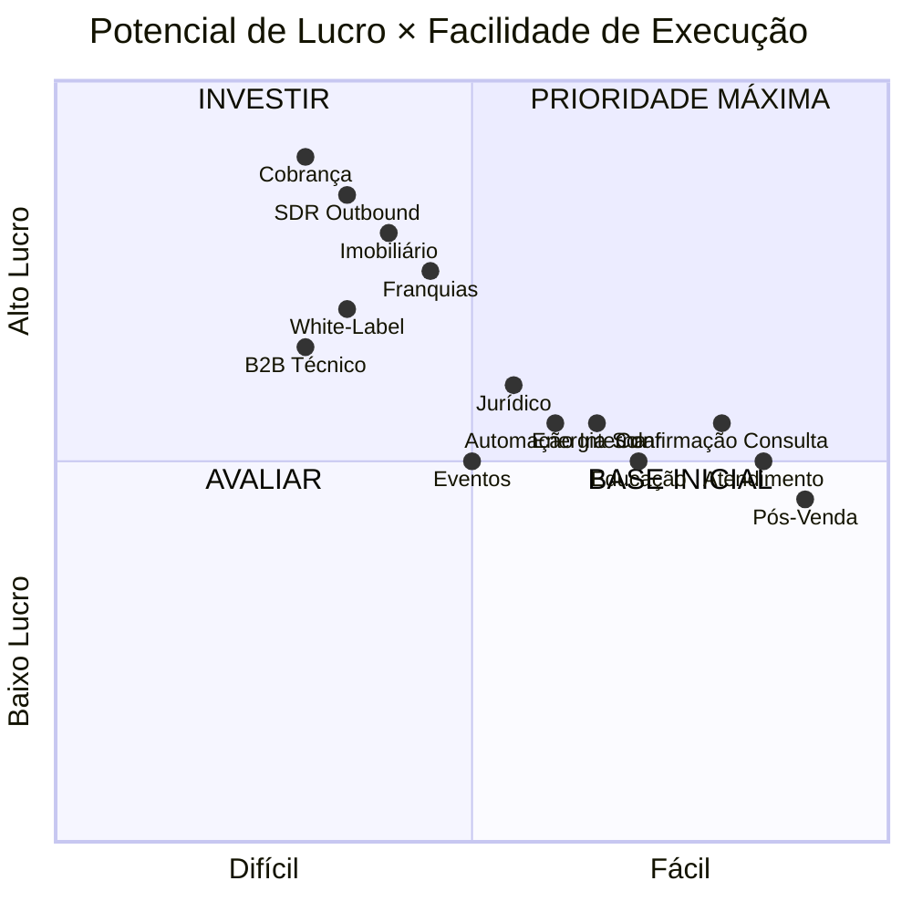
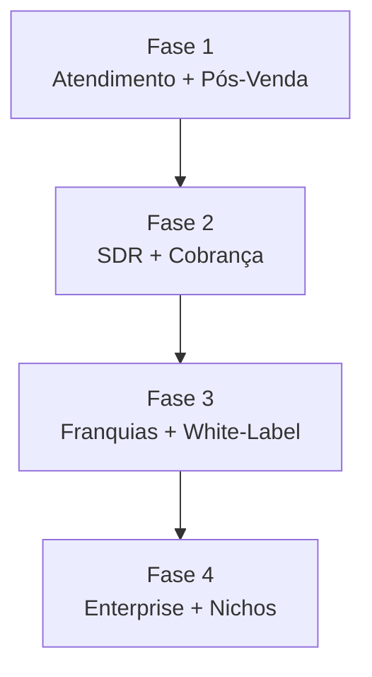

# 4. Catálogo de Casos de Uso

[← Project Types](03_project_types.md) | [Índice](README.md) | [Planos e Precificação →](05_planos_precificacao.md)

---

## 📊 Matriz de Prioridade

---

## 🟢 Categoria A — Mais Fáceis + Boa Margem

### 1. Atendimento + Agendamento
- **Ticket**: Médio (R$ 997/mês) | **Complexidade**: Baixa | **Margem**: ~80%
- **Público**: Clínicas, dentistas, barbearias, imobiliárias
- **ROI**: Cliente percebe valor em 7 dias

### 2. Pós-Venda / NPS / Follow-Up
- **Ticket**: Médio (R$ 997–1.497/mês) | **Complexidade**: Baixa | **Margem**: Muito alta
- **Público**: Qualquer empresa com base ativa
- **ROI**: Retenção + reagendamento

### 3. Confirmação de Consultas
- **Ticket**: R$ 997–1.497/mês ou R$ 4/confirmação
- **ROI absurdo**: Clínica com 20% de no-show e ticket R$ 300 → perde R$ 30k/mês. Reduzir 50% = recuperar R$ 15k. Você cobra R$ 1.200.

### 4. Automação Interna (RH / TI)
- **Ticket**: R$ 3k–8k/mês | Enterprise Light
- **Público**: Empresas médias, escritórios, contabilidade

---

## 🔵 Categoria B — Alto Lucro + Escaláveis

### 5. SDR Outbound
- **Ticket**: R$ 2.500/mês + ou R$ 15/lead qualificado
- **ROI**: Substitui SDR humano de R$ 3k–5k/mês
- **Modelo híbrido IA + humano**: IA filtra 80% lixo, humano foca nos qualificados

### 6. Lançamentos Imobiliários
- **Ticket**: R$ 2.500–5.000/mês ou R$ 15/lead
- **Público**: Construtoras, incorporações
- **Diferencial**: Classificação A/B/C automática, picos de campanha

### 7. Cobrança / Recuperação Financeira
- **Ticket**: R$ 2.500/mês + consumo OU 8% sobre valor recuperado
- **ROI**: Recupera R$ 100k/mês → você ganha R$ 8k

### 8. Pré-Qualificação de Crédito
- **Ticket**: R$ 2k–5k/mês ou R$ 20/lead elegível
- **Público**: Concessionárias, consórcios, energia solar, bancos regionais

---

## 🟣 Categoria C — Nichos Especializados

### 9. Triagem Jurídica
- **Ticket**: R$ 1.497–2.500/mês ou R$ 40/caso elegível
- **Público**: Escritórios de advocacia, franquias jurídicas
- **Diferencial**: 60–80% das ligações não viram caso → IA filtra

### 10. Educação (Captação de Alunos)
- **Ticket**: R$ 997–1.997/mês
- **Público**: Escolas, faculdades, cursos

### 11. Energia Solar / Seguros
- **Ticket**: Alto | SDR + pré-qualificação integrados

---

## 🔴 Categoria D — Grandes Estruturas

### 12. Multi-Unidade / Franquias
- **Ticket**: R$ 600/unidade → rede 40 unidades = R$ 24k/mês
- **Estrutura**: Partner → Tenant por unidade, dashboard consolidado

### 13. White-Label Infra
- **Ticket**: R$ 400–600/cliente para agência
- **Escala**: 10 agências × 30 clientes = R$ 120k–180k/mês

### 14. Eventos e Lançamentos Presenciais
- **Ticket**: R$ 1.500–3.000/evento ou R$ 10/confirmação
- **Público**: Congressos, feiras, workshops, lançamentos

### 15. B2B Técnico / Industrial
- **Ticket**: R$ 3k–8k/mês | Pouca concorrência

---

## 📊 Ranking por Potencial de Lucro

| # | Caso de Uso | Ticket | Escalabilidade | Risco |
|---|------------|--------|---------------|-------|
| 1 | Cobrança | Muito alto | Alta | Médio |
| 2 | SDR Outbound | Alto | Muito alta | Médio |
| 3 | Imobiliário | Muito alto | Alta | Médio |
| 4 | Franquias | Alto | Muito alta | Baixo |
| 5 | White-Label | Médio (volume) | Muito alta | Médio |
| 6 | B2B Técnico | Alto | Média | Baixo |
| 7 | Crédito | Alto | Alta | Médio |
| 8 | Jurídico | Médio/Alto | Média | Baixo |

---

## 🎯 Ordem de Ataque Recomendada

---

[← Project Types](03_project_types.md) | [Índice](README.md) | [Planos e Precificação →](05_planos_precificacao.md)
