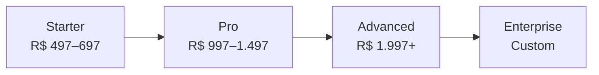
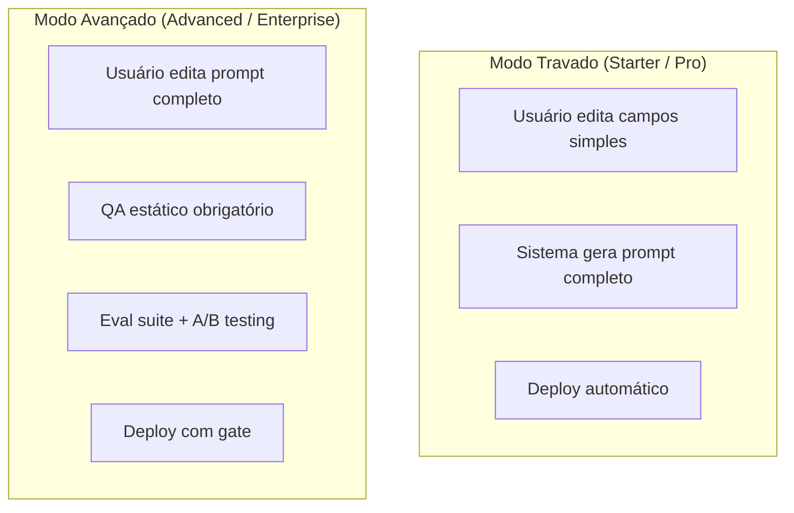

# 5. Planos e Precificação

[← Casos de Uso](04_casos_de_uso.md) | [Índice](README.md) | [Simulação Financeira →](06_simulacao_financeira.md)

---

## 🏗️ Estrutura de Planos

---

## 📋 Detalhamento dos Planos

### Features de Agente

| Recurso | Starter | Pro | Advanced | Enterprise |
|---------|---------|-----|----------|------------|
| **Preço** | R$ 497–697 | R$ 997–1.497 | R$ 1.997+ | Custom |
| Projetos | 1 | 5 | 20 | Ilimitado |
| Modo | 🔒 Travado | 🔒 Travado | 🧠 Avançado | 🧠 Avançado |
| Minutos/mês | 30 | 500 | 2.000 | 10.000+ |
| Calls/dia | 5 | 100 | 500 | Ilimitado |
| Budget cap | R$ 20 | R$ 500 | R$ 2.000 | Custom |
| Outbound voz | ❌ | ✅ | ✅ | ✅ |
| Campanhas | ❌ | ✅ | ✅ | ✅ |

### Canais

| Canal | Starter | Pro | Advanced | Enterprise |
|-------|---------|-----|----------|------------|
| Voz inbound | ✅ | ✅ | ✅ | ✅ |
| Web widget | ✅ | ✅ | ✅ | ✅ |
| Voz outbound | ❌ | ✅ | ✅ | ✅ |
| SMS | ❌ | ✅ | ✅ | ✅ |
| Telegram Bot | ❌ | ✅ | ✅ | ✅ |
| Telegram Notificações | ❌ | ✅ | ✅ | ✅ |

### Inteligência

| Feature | Starter | Pro | Advanced | Enterprise |
|---------|---------|-----|----------|------------|
| Knowledge Base | ✅ | ✅ | ✅ | ✅ |
| GraphRAG | ❌ | ❌ | ✅ | ✅ |
| QA Auto-Evaluate | ❌ | ❌ | ✅ | ✅ |
| A/B Testing | ❌ | ❌ | ✅ | ✅ |
| Auto-Tuning IA | ❌ | ❌ | ✅ | ✅ |
| AI Dashboard | ❌ | ✅ | ✅ | ✅ |
| Chat LLM | ✅ (flash) | ✅ (pro) | ✅ (pro) | ✅ (pro) |

### Comunicação e CRM

| Feature | Starter | Pro | Advanced | Enterprise |
|---------|---------|-----|----------|------------|
| CRM Omnichannel | ❌ | ✅ | ✅ | ✅ |
| Cross-channel handoff | ❌ | ❌ | ✅ | ✅ |
| Formulários | ✅ (2) | ✅ (10) | ✅ (50) | Ilimitado |
| Webhooks saída | ❌ | ✅ (5) | ✅ (20) | Ilimitado |
| Integrações | ❌ | ✅ (5) | ✅ (20) | Ilimitado |
| Mídia/storage | 0.5 GB | 5 GB | 50 GB | 500 GB |

### Funcionalidades Avançadas

| Feature | Starter | Pro | Advanced | Enterprise |
|---------|---------|-----|----------|------------|
| BYOK (chaves próprias) | ❌ | ❌ | ✅ | ✅ |
| Custom Tools | ❌ | ❌ | ✅ | ✅ |
| Squads (multi-agent) | ❌ | ❌ | ✅ | ✅ |
| Voice Clone | ❌ | ✅ (2) | ✅ (10) | Ilimitado |
| Workflow Builder | ❌ | ❌ | ✅ | ✅ |
| White-Label | ❌ | ❌ | ❌ | ✅ |
| API Keys | ❌ | ✅ | ✅ | ✅ |
| Feature Flags | ❌ | ❌ | ❌ | ✅ (admin) |

### Retenção e Segurança

| Feature | Starter | Pro | Advanced | Enterprise |
|---------|---------|-----|----------|------------|
| Audit trail | 30 dias | 90 dias | 365 dias | Ilimitado |
| 2FA (TOTP) | ✅ | ✅ | ✅ | ✅ |
| Device Tracker | ❌ | ✅ | ✅ | ✅ |
| LGPD Portability | ✅ | ✅ | ✅ | ✅ |
| Suporte | Email | Email + Chat | Prioritário | Dedicado |
| SLA | — | — | — | ✅ |

---

## 💰 Add-ons (Margem Alta)

| Add-on | Preço | Plano mínimo |
|--------|-------|-------------|
| Pack de Minutos Extra | +R$ 197/500min | Qualquer |
| Multi-Project Pack | +R$ 197/mês | Starter |
| Outbound Campaign | +R$ 297/mês | Pro |
| Advanced Mode | +R$ 397/mês | Pro |
| White-Label | +R$ 497/mês | Advanced |
| BYOK (chaves próprias) | +R$ 297/mês | Advanced |
| Multi-Language | +R$ 197/mês | Advanced |
| Scorecards Avançados | +R$ 197/mês | Pro |

---

## 🔒 Guardrails por Plano

| Controle | Travado | Avançado |
|----------|---------|----------|
| Prompt editável | ❌ Injetado por template | ✅ Direto |
| Tools editáveis | ❌ Preset | ✅ Custom + custom tools |
| Deploy | Auto | Com QA gate |
| Versões | Auto | Manual + diff visual |
| Rollback | N/A | ✅ |

---

## ⚙️ Entitlements Engine (19 guardrails)

O sistema possui um motor de entitlements com **19 verificações automáticas** que bloqueiam ações conforme o plano:

| Entitlement | O que verifica |
|-------------|---------------|
| `can_create_project?` | Limite de projetos |
| `can_use_outbound?` | Outbound habilitado |
| `can_use_sms?` | SMS habilitado |
| `can_use_custom_voices?` | Voice clone habilitado |
| `can_use_graphrag?` | GraphRAG habilitado |
| `can_use_telegram_bot?` | Telegram bot habilitado |
| `can_use_forms?` | Forms habilitado |
| `can_create_form?` | Limite de forms |
| `can_use_integrations?` | Integrações habilitadas |
| `can_add_integration?` | Limite de integrações |
| `can_use_webhooks?` | Webhooks habilitados |
| `can_add_webhook?` | Limite de webhooks |
| `can_use_omnichannel?` | CRM omnichannel |
| `can_upload_media?` | Limite de storage |
| `can_clone_voice?` | Limite de clones de voz |
| `can_start_call?` | Limite diário de calls |
| `can_use_kb?` | Knowledge Base |
| `can_use_telegram_notifications?` | Notificações Telegram |
| `can_use_telegram_ai?` | Chat IA no Telegram |

> O EntitlementGuard é um hook LiveView que bloqueia automaticamente páginas sem permissão.

---

## 🧮 Estratégia de Custo

### Custo médio por minuto (Brasil)

| Componente | Custo estimado |
|-----------|---------------|
| STT (Deepgram) | R$ 0,02–0,05 |
| LLM (GPT-4o) | R$ 0,03–0,08 |
| TTS (ElevenLabs) | R$ 0,03–0,08 |
| Telefonia (Twilio BR) | R$ 0,05–0,12 |
| **Total** | **R$ 0,15–0,30** |

### Regra de ouro: **Margem mínima 70%**

---

## 💳 Modelos de Cobrança por Tipo

| Modelo | Quando usar | Exemplo |
|--------|------------|---------|
| SaaS fixo | Atendimento, agendamento | R$ 997/mês |
| SaaS + consumo | Qualquer | R$ 997 + R$ 0,50/min extra |
| Performance | Outbound, cobrança | R$ 997 + R$ 15/lead |
| % sobre resultado | Cobrança financeira | R$ 997 + 8% recuperado |
| Setup + mensalidade | DFY / agência | R$ 2k–10k + R$ 997/mês |
| Atacado (white-label) | Parceiros | R$ 400–600/tenant |

---

[← Casos de Uso](04_casos_de_uso.md) | [Índice](README.md) | [Simulação Financeira →](06_simulacao_financeira.md)
