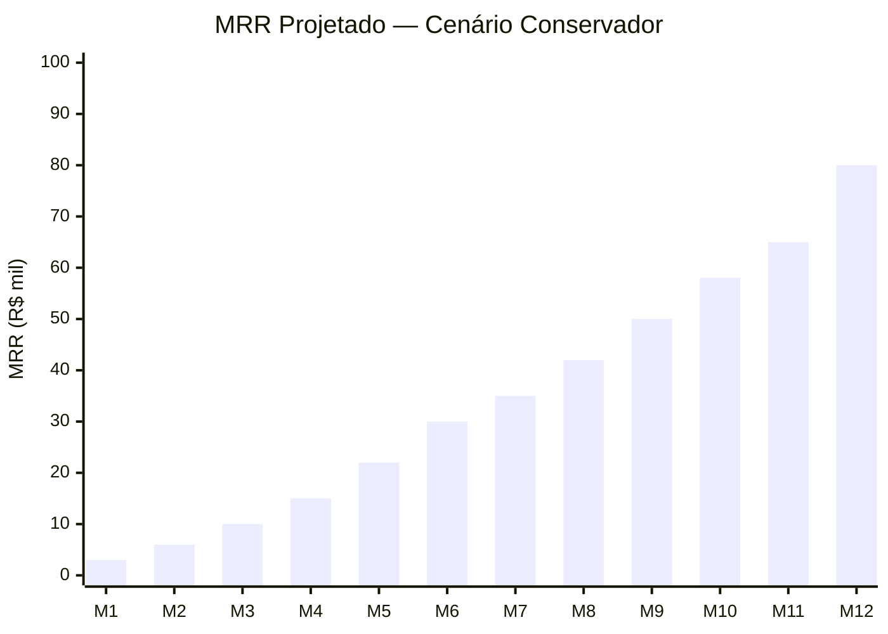
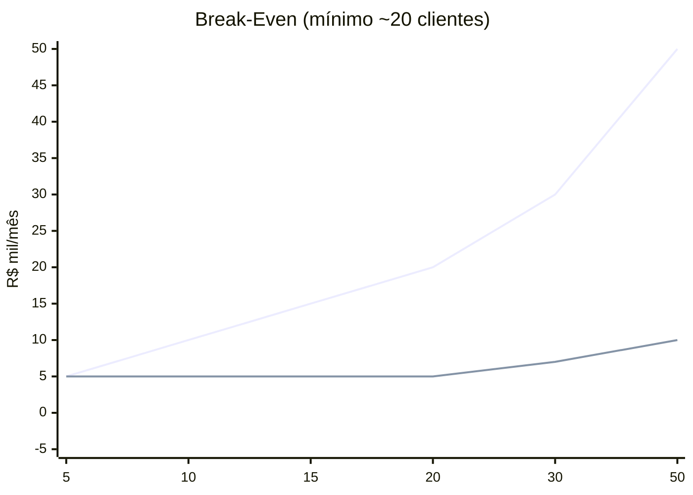

# 6. Simulação Financeira

[← Planos](05_planos_precificacao.md) | [Índice](README.md) | [Arquitetura →](07_arquitetura_empresarial.md)

---

## 💰 Unit Economics — Cliente Médio

| Métrica | Valor |
|---------|-------|
| Receita média/mês | R$ 1.200 |
| Custo variável | R$ 200–300 |
| Margem bruta | ~75–85% |
| LTV (12 meses) | R$ 14.400 |
| Churn alvo | < 5% mensal |

---

## 📊 Cenário Conservador (Brasil, foco nacional)

| Período | Clientes | MRR | Receita Acumulada |
|---------|----------|-----|-------------------|
| Mês 3 | 10 | R$ 10k | R$ 19k |
| Mês 6 | 30 | R$ 30k | R$ 95k |
| Mês 9 | 50 | R$ 50k | R$ 225k |
| Mês 12 | 80 | R$ 80k | R$ 500k |

---

## 📊 Cenário Agressivo (com White-Label)

| Período | Diretos | Indiretos | MRR Total |
|---------|---------|-----------|-----------|
| Mês 6 | 20 | 30 | R$ 40k |
| Mês 12 | 40 | 100 | R$ 120k |
| Ano 2 | 80 | 300 | R$ 300k |
| Ano 3 | 120 | 500+ | R$ 600k–800k |

---

## 📊 Projeção Cenário B (Plataforma Ambiciosa)

| Ano | Receita | Clientes | Observação |
|-----|---------|----------|------------|
| Ano 1 | R$ 150k–300k | 30–80 | Construindo base |
| Ano 2 | R$ 1.2M–3.6M | 100–300 | Self-serve + White-label |
| Ano 3 | R$ 3.6M–9.6M | 300–800 | Dominância |

---

## 🧮 Custos Fixos Estimados

| Item | Custo Mensal |
|------|-------------|
| Fly.io (2 instâncias + DB) | R$ 500–1.500 |
| Domínio + SSL | R$ 50 |
| Sentry / AppSignal | R$ 150 |
| Tools dev (GitHub Pro etc) | R$ 100 |
| Marketing (mínimo) | R$ 1k–3k |
| **Total mínimo** | **R$ 2k–5k** |

---

## 📉 Break-Even Analysis

| Clientes | Receita | Custos | Lucro |
|----------|---------|--------|-------|
| 10 | R$ 10k | R$ 5k | R$ 5k |
| 20 | R$ 20k | R$ 5k | R$ 15k |
| 50 | R$ 50k | R$ 10k | R$ 40k |
| 200 | R$ 200k | R$ 30k | R$ 170k |

> **Break-even**: ~5–6 meses com execução consistente.

---

## 📊 Métricas-Chave (KPIs)

| KPI | Meta |
|-----|------|
| CAC (Custo de Aquisição) | < R$ 500 |
| LTV | > R$ 10k |
| LTV/CAC Ratio | > 3:1 |
| Churn mensal | < 5% |
| ARPU (receita por cliente) | R$ 1.200+ |
| MRR Growth Rate | > 15%/mês |

---

## 🏢 Estrutura de Time (futuro)

| Fase | Equipe | Custo mensal |
|------|--------|-------------|
| Solo | Fundador | R$ 0 (sweat equity) |
| +6 meses | +1 dev | R$ 8k–12k |
| +12 meses | +1 CS + 1 vendas | R$ 16k–20k |
| +18 meses | +1 dev frontend + 1 marketing | R$ 24k–30k |

---

## 📊 Custo de Desenvolvimento

| Item | Horas | Custo implícito |
|------|-------|----------------|
| Core Platform (MVP) | 300–400h | R$ 45k–60k |
| Self-serve completo | 200–300h | R$ 30k–45k |
| White-label + Enterprise | 100–200h | R$ 15k–30k |
| **Total** | **600–900h** | **R$ 90k–135k** |

> Baseado em custo-hora Senior Elixir: R$ 100–150/h

---

## ⚠️ Riscos Financeiros

| Risco | Impacto | Mitigação |
|-------|---------|-----------|
| Cliente gera custo alto | Prejuízo | Budget cap obrigatório |
| Churn alto | Receita cai | Guardrails + ROI claro |
| BYOK reduz margem | Margem cai | Cobrar add-on premium |
| Outbound explode custo | Prejuízo | Rate limit + entitlements |
| Telefonia BR cara | Margem menor | BYOC + absorver parcial |

---

[← Planos](05_planos_precificacao.md) | [Índice](README.md) | [Arquitetura →](07_arquitetura_empresarial.md)
