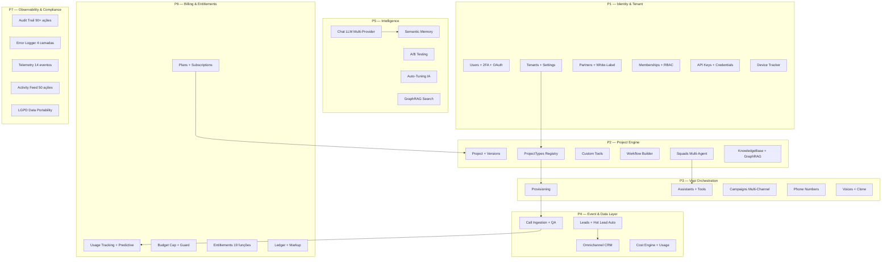
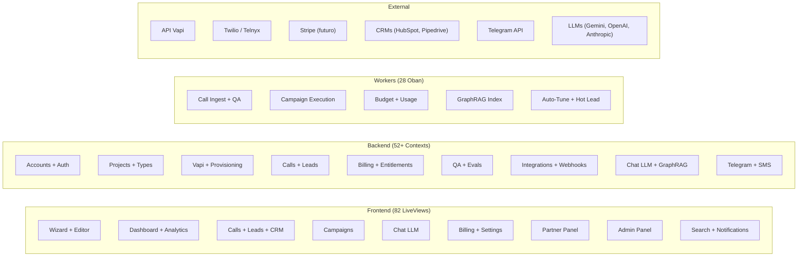
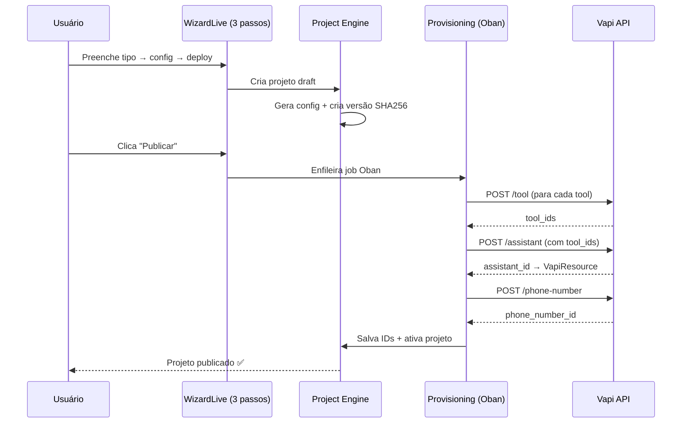
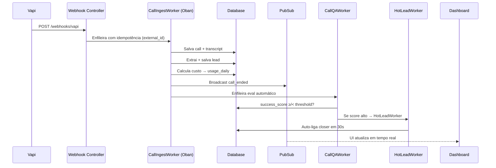
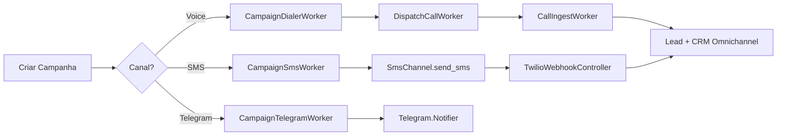
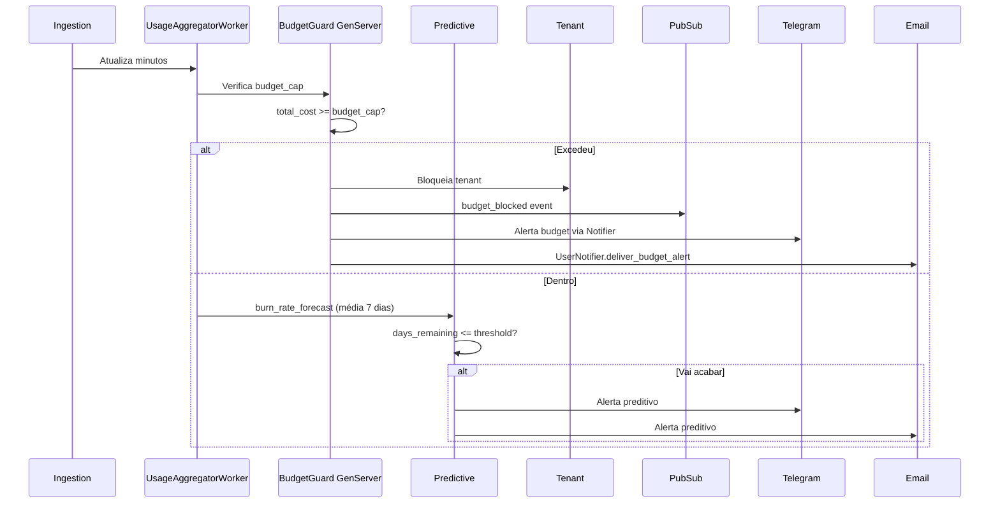
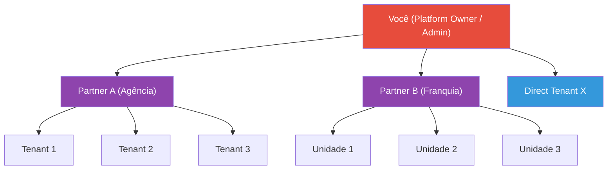

# 7. Arquitetura Empresarial

[← Simulação Financeira](06_simulacao_financeira.md) | [Índice](README.md) | [Modelo de Dados →](08_modelo_dados.md)

---

## 🏗️ Pilares da Plataforma

---

## 📐 Diagrama de Componentes

---

## 🔄 Fluxos Críticos

### Fluxo 1: Provisionamento de Projeto

### Fluxo 2: Ingestão de Chamada

### Fluxo 3: Campanha Multi-Channel

### Fluxo 4: Budget Cap + Billing Preditivo

---

## 🔐 Hierarquia Multi-Tenant

**RBAC por Membership:**
- `admin` — Tudo (edit, publish, billing, settings, invite, feature flags)
- `operator` — Edit + publish + view dashboard
- `viewer` — Somente visualização
- `custom` — Definido por TenantRole.permissions (JSONB)

---

## 🧱 Módulos Elixir (52+ Contexts)

| # | Context | Responsabilidade |
|---|---------|-----------------|
| 1 | `Accounts` | Users, Tenants, Partners, Memberships, Auth, 2FA, Devices, OAuth, API Keys, Credentials, Policy |
| 2 | `Projects` | Projects, Types, Versions, Deployments, Custom Tools, Workflows |
| 3 | `Vapi` | Client HTTP (retry + circuit breaker), Provisioning, VapiResource |
| 4 | `Calls` | Ingestion, Transcripts, CallMonitor GenServer |
| 5 | `Leads` | Leads, qualification, promote to contact |
| 6 | `Campaigns` | Campaign lifecycle, CampaignLeads, multi-channel dispatch |
| 7 | `Billing` | Plans, Subscriptions, Usage, Entitlements, BudgetGuard, Ledger, Markup, Predictive |
| 8 | `QA / Evals` | StaticValidator, EvalRunner, EvalSuites, CI.ValidationPipeline |
| 9 | `Chat` | ChatSession, LLM multi-provider (Gemini/OpenAI/Anthropic), 80+ tools, SystemKnowledge, Tracer |
| 10 | `KnowledgeBase` | File upload, indexação, search |
| 11 | `KnowledgeGraph` | GraphRAG (entities, relationships, search semântico) |
| 12 | `Omnichannel` | Contacts, Threads, Messages, cross-channel handoff |
| 13 | `Telegram` | Bot GenServer, 7 comandos, Notifier, RateLimiter, Session, LinkToken |
| 14 | `SMS` | SmsSession, SmsChannel (Twilio), DNC |
| 15 | `Voices` | CustomVoice, VoiceClone (ElevenLabs) |
| 16 | `Analytics` | Boards, Widgets configuráveis |
| 17 | `Forms` | FormTemplate, FormSubmission |
| 18 | `Integrations` | IntegrationDefinition (8 tipos), TenantIntegration |
| 19 | `Webhooks` | Outbound webhooks (23 eventos), DeliveryLog |
| 20 | `Squads` | Squad, SquadMember, multi-agent handoff |
| 21 | `Audit` | AuditLog (90+ ações), AuditConfig, AuditHook |
| 22 | `Activities` | ActivityLog (50 ações humanizadas), feed com PubSub |
| 23 | `Notifications` | In-app notifications |
| 24 | `Alerts` | Email + Webhook alertas, LLMAlertHandler |
| 25 | `FeatureFlags` | Flags com rollout %, overrides, QA circuit breaker |
| 26 | `Media` | MediaFile upload, storage |
| 27 | `Search` | Busca paralela global (9 tipos), cache ETS |
| 28 | `Config` | 664 funções tipadas + Settings DB-backed |
| 29 | `ErrorLogger` | GenServer 4 camadas (backend + frontend) |
| 30 | `DataExchange` | LGPD import/export |
| 31 | `Templates` | Biblioteca de templates de agente |
| 32 | `Mcp` | Model Context Protocol (34 tools) |

---

## ✅ Validação de Compatibilidade

| Modelo de Negócio | Suportado? | Pilares responsáveis |
|-------------------|------------|----------------------|
| Agência DFY | ✅ | P1 + P2 + P3 |
| Self-serve | ✅ | P2 + P5 + P6 + P7 |
| White-label | ✅ | P1 (Partners + WhiteLabel plug) |
| Enterprise | ✅ | P7 (Audit + LGPD) + P6 |
| Performance | ✅ | P4 (Leads + Hot Lead) + P6 |
| Outbound | ✅ | P3 (Campaigns multi-channel) |
| Franquias | ✅ | P1 (Hierarquia) |
| BYOK/BYOC | ✅ | P1 (Credentials criptografadas) |
| Marketplace | ✅ | P2 (Templates) + P6 |

> **Conclusão**: A arquitetura é **agnóstica ao modelo de negócio**. O que muda é configuração, não código.

---

[← Simulação Financeira](06_simulacao_financeira.md) | [Índice](README.md) | [Modelo de Dados →](08_modelo_dados.md)
