# 8. Modelo de Dados (ERD)

[← Arquitetura](07_arquitetura_empresarial.md) | [Índice](README.md) | [Guardrails e QA →](09_guardrails_qa.md)

---

## 🗄️ ERD Completo — 62 Tabelas

```mermaid
erDiagram
    USERS ||--o{ MEMBERSHIPS : has
    USERS ||--o{ USER_DEVICES : has
    USERS ||--o{ USER_IDENTITIES : has
    USERS ||--o{ API_KEYS : has
    TENANTS ||--o{ MEMBERSHIPS : has
    TENANTS ||--o{ TENANT_ROLES : defines
    PARTNERS ||--o{ MEMBERSHIPS : has
    PARTNERS ||--o{ TENANTS : manages
    PLANS ||--o{ SUBSCRIPTIONS : used_by
    TENANTS ||--o{ SUBSCRIPTIONS : has
    TENANTS ||--o{ PROJECTS : has
    TENANTS ||--o{ CREDENTIALS : stores
    PROJECTS ||--o{ PROJECT_VERSIONS : has
    PROJECTS ||--o{ DEPLOYMENTS : has
    PROJECTS ||--o{ VAPI_RESOURCES : maps
    PROJECTS ||--o{ CUSTOM_TOOLS : has
    PROJECTS ||--o{ CALLS : receives
    PROJECTS ||--o{ SQUADS : has
    SQUADS ||--o{ SQUAD_MEMBERS : has
    PROJECTS ||--o{ CAMPAIGNS : runs
    CAMPAIGNS ||--o{ CAMPAIGN_LEADS : tracks
    CALLS ||--o{ LEADS : generates
    LEADS }o--o| OMNI_CONTACTS : promoted_to
    TENANTS ||--o{ USAGE_DAILY : tracks
    TENANTS ||--o{ OMNI_CONTACTS : has
    OMNI_CONTACTS ||--o{ OMNI_THREADS : has
    OMNI_THREADS ||--o{ OMNI_MESSAGES : has
    TENANTS ||--o{ FORM_TEMPLATES : has
    FORM_TEMPLATES ||--o{ FORM_SUBMISSIONS : receives
    TENANTS ||--o{ TENANT_INTEGRATIONS : configures
    TENANTS ||--o{ OUTBOUND_WEBHOOKS : has
    OUTBOUND_WEBHOOKS ||--o{ WEBHOOK_DELIVERY_LOGS : logs
    TENANTS ||--o{ AUDIT_LOGS : logs
    TENANTS ||--o{ ACTIVITY_LOGS : tracks
    TENANTS ||--o{ NOTIFICATIONS : has
    TENANTS ||--o{ ANALYTICS_BOARDS : has
    ANALYTICS_BOARDS ||--o{ ANALYTICS_WIDGETS : contains
    TENANTS ||--o{ CUSTOM_VOICES : has
    TENANTS ||--o{ MEDIA_FILES : stores
    PROJECTS ||--o{ KB_FILES : has
    KB_FILES ||--o{ GRAPH_ENTITIES : indexed_from
    GRAPH_ENTITIES ||--o{ GRAPH_RELATIONSHIPS : has
    TENANTS ||--o{ CHAT_SESSIONS : has
    TENANTS ||--o{ SMS_SESSIONS : has
    PROJECTS ||--o{ EVAL_SUITES : has
    EVAL_SUITES ||--o{ EVAL_RESULTS : runs
    PROJECTS ||--o{ AGENT_EXPERIMENTS : has
    PROJECTS ||--o{ AGENT_TUNING_SUGGESTIONS : has
    TENANTS ||--o{ TELEGRAM_NOTIFICATION_RULES : configures
    TENANTS ||--o{ TELEGRAM_NOTIFICATION_LOGS : logs
```



---

## 📋 Tabelas por Domínio

### 🔐 Identity & Multi-Tenant (12 tabelas)

| Tabela | Campos-chave |
|--------|-------------|
| `users` | email, status (active/suspended/pending), role, name, totp_secret, 2FA fields |
| `tenants` | name, slug, status (active/suspended), type (direct/partner), settings JSONB |
| `memberships` | user_id, tenant_id, role (admin/operator/viewer/custom), custom_role_id |
| `partners` | name, status, billing_model (commission/markup/flat), branding JSONB |
| `api_keys` | key_hash (bcrypt), name, scopes, last_used_at |
| `credentials` | provider (vapi/openai/elevenlabs/twilio/google/anthropic/deepgram/azure/custom), encrypted_key (Cloak) |
| `user_devices` | device_name, fingerprint, trusted, browser, os, ip |
| `user_identities` | provider (google/github), uid |
| `temporary_passwords` | password_hash, expires_at |
| `waitlist` | email, status |
| `tenant_roles` | name, permissions JSONB |
| `users_tokens` | token, context (session/magic_link) |

### 🧱 Project Engine (7 tabelas)

| Tabela | Campos-chave |
|--------|-------------|
| `projects` | name, mode (locked/advanced), status (draft/active/paused), agent_type, config JSONB, system_prompt |
| `project_versions` | version, config JSONB, environment, checksum SHA256 |
| `deployments` | environment (staging/production), deployed_at, vapi_resource_id |
| `custom_tools` | name, type (function/webhook), method, parameters_schema JSONB |
| `vapi_resources` | resource_type, vapi_id |
| `agent_experiments` | experiment_type (prompt/voice/model), status, winner (a/b/none), results JSONB |
| `agent_tuning_suggestions` | suggestion_type, suggestion JSONB, status (pending/applied/dismissed) |

### 📞 Calls & Leads (3 tabelas)

| Tabela | Campos-chave |
|--------|-------------|
| `calls` | vapi_call_id UNIQUE, type (inbound/outbound/web), duration_minutes, cost, transcript, success_score, summary |
| `webhook_events` | event_type, payload JSONB, status (pending/processed/failed) |
| `leads` | name, phone, email, score, interest_level, sentiment, omni_contact_id FK, payload JSONB |

### 📢 Campaigns (2 tabelas)

| Tabela | Campos-chave |
|--------|-------------|
| `campaigns` | name, status (draft/running/paused/completed/failed), channel (voice/sms/telegram), settings JSONB |
| `campaign_leads` | phone, status (pending/calling/completed/failed/skipped), attempts, last_attempt_at |

### 💰 Billing (5 tabelas)

| Tabela | Campos-chave |
|--------|-------------|
| `plans` | name, mode (locked/advanced), price_monthly, features JSONB (30 keys), limits JSONB |
| `subscriptions` | status (active/canceled/expired/trial), is_trial, trial_ends_at |
| `usage_daily` | date, minutes, calls_count, estimated_cost |
| `billable_events` | event_type, amount_cents, call_id FK |
| `billing_markups` | markup_type, percentage, flat_fee |

### 🌐 Omnichannel CRM (3 tabelas)

| Tabela | Campos-chave |
|--------|-------------|
| `omni_contacts` | phone_number, email, name, telegram_chat_id, last_channel |
| `omni_threads` | channel (sms/telegram/voice_vapi/web_chat), status (open/closed/archived), sentiment, tags |
| `omni_messages` | role, content, channel |

### 📝 Forms (2 tabelas)

| Tabela | Campos-chave |
|--------|-------------|
| `form_templates` | name, slug, fields JSONB, active |
| `form_submissions` | data JSONB |

### 🧠 Knowledge & Graph (3 tabelas)

| Tabela | Campos-chave |
|--------|-------------|
| `knowledge_base_files` | file_name, vapi_file_id, status, s3_key, url |
| `graph_entities` | name, type, embedding (vector), summary |
| `graph_relationships` | relationship_type, source_id, target_id |

### 📊 Analytics (2 tabelas)

| Tabela | Campos-chave |
|--------|-------------|
| `analytics_boards` | name, widgets JSONB |
| `analytics_widgets` | widget_type, config JSONB, position, dimensions |

### 🔌 Integrations & Webhooks (4 tabelas)

| Tabela | Campos-chave |
|--------|-------------|
| `tenant_integrations` | integration_type (8 providers), credentials (encrypted), active |
| `outbound_webhooks` | name, url, secret, events (23 válidos), active |
| `webhook_delivery_logs` | event_type, status_code, response_ms |
| `media_files` | filename, content_type, size_bytes, storage_path, public_url |

### 🤖 Squads & Voices (3 tabelas)

| Tabela | Campos-chave |
|--------|-------------|
| `squads` | name, vapi_squad_id, transfer_mode |
| `squad_members` | role, assistant_config JSONB, voice_id |
| `custom_voices` | name, vapi_voice_id, provider, status |

### 💬 Chat & SMS (2 tabelas)

| Tabela | Campos-chave |
|--------|-------------|
| `chat_sessions` | user_id, tenant_id, history JSONB |
| `sms_sessions` | phone_number, thread_id |

### 🔍 QA & Evals (2 tabelas)

| Tabela | Campos-chave |
|--------|-------------|
| `eval_suites` | name, scenarios JSONB, min_passing_score |
| `eval_results` | score, feedback, overall_score |

### 📢 Telegram (3 tabelas)

| Tabela | Campos-chave |
|--------|-------------|
| `telegram_notification_rules` | event_type, enabled |
| `telegram_notification_logs` | event_type, delivered |
| `telegram_sessions` | chat_id, state |

### 🔍 System & Audit (5 tabelas)

| Tabela | Campos-chave |
|--------|-------------|
| `audit_logs` | action (90+), resource_type, details JSONB, metadata JSONB |
| `audit_configs` | action_type, enabled, is_protected |
| `activity_logs` | action (50 humanized), resource_type, details JSONB |
| `system_settings` | key, value JSONB |
| `feature_flags` | name, enabled, rollout_percentage, overrides |
| `notifications` | type (info/warning/error/success), title, action_url, read |

---

## 🔑 Índices Críticos

```sql
CREATE INDEX idx_calls_project_id ON calls(project_id, inserted_at DESC);
CREATE INDEX idx_leads_project_id ON leads(project_id, inserted_at DESC);
CREATE INDEX idx_usage_daily_tenant ON usage_daily(tenant_id, date);
CREATE INDEX idx_campaign_leads_campaign ON campaign_leads(campaign_id, status);
CREATE INDEX idx_audit_logs_tenant ON audit_logs(tenant_id, inserted_at DESC);
CREATE UNIQUE INDEX idx_calls_vapi_id ON calls(vapi_call_id);
CREATE INDEX idx_omni_contacts_phone ON omni_contacts(phone_number, tenant_id);
CREATE INDEX idx_omni_threads_contact ON omni_threads(contact_id, status);
CREATE INDEX idx_graph_entities_type ON graph_entities(entity_type, tenant_id);
```

---

[← Arquitetura](07_arquitetura_empresarial.md) | [Índice](README.md) | [Guardrails e QA →](09_guardrails_qa.md)
