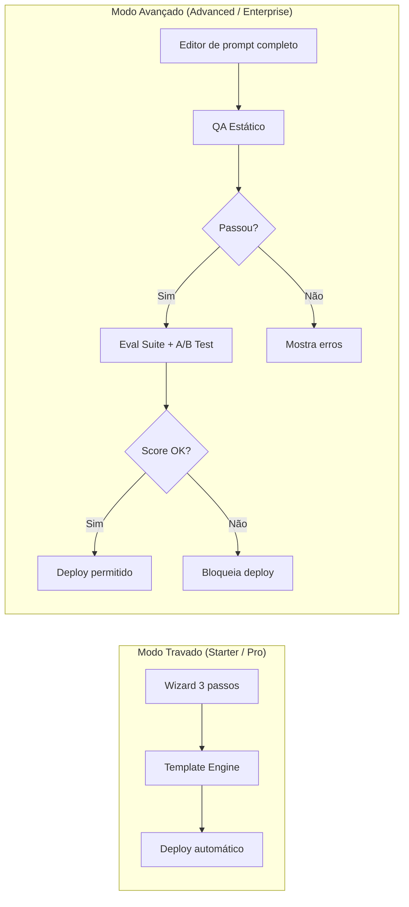
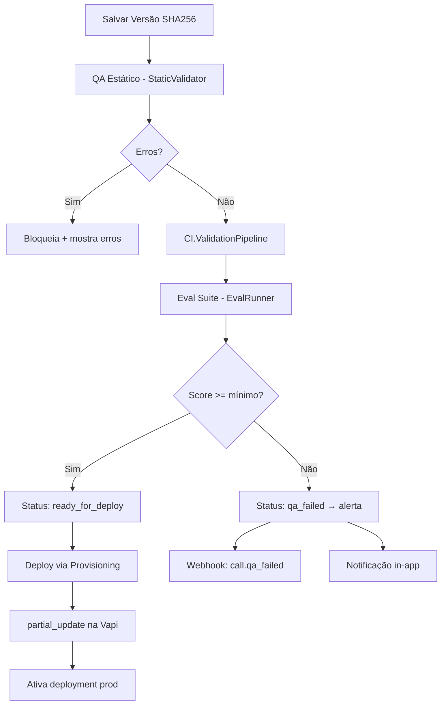
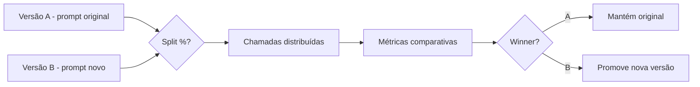
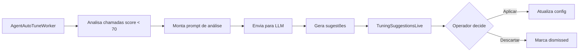

# 9. Guardrails e QA

[← Modelo de Dados](08_modelo_dados.md) | [Índice](README.md) | [Roadmap Técnico →](10_roadmap_tecnico.md)

---

## 🔒 Modo Travado vs Avançado

| Aspecto | Travado | Avançado |
|---------|---------|----------|
| Prompt | Template injetado | Editável direto |
| Tools | Preset | Custom + custom tools |
| Deploy | Automático | Gate QA obrigatório |
| Versões | Auto (SHA256) | Manual + diff visual |
| Rollback | N/A | ✅ Por versão |
| A/B Testing | ❌ | ✅ |
| Auto-Tuning | ❌ | ✅ |
| Suporte | Mínimo | Médio |

---

## ✅ QA Pipeline Completo

---

### 1️⃣ QA Estático (`StaticValidator`)

Roda **sempre** que salva, **sem custo**.

| Validação | O que verifica |
|-----------|---------------|
| Prompt | Contém identidade, objetivo, regra de não inventar, fallback humano |
| Prompt (negação) | Não contém palavras proibidas (regex) |
| First message | Existe e tem tamanho adequado |
| Tools | Schema JSON válido, sem nomes duplicados |
| Entitlements | Plano permite outbound? Advanced? BYOK? Custom tools? |
| Config | Campos obrigatórios preenchidos |

---

### 2️⃣ CI Validation Pipeline

Pipeline de validação contínua antes de deploy.

---

### 3️⃣ QA Dinâmico (Evals)

Usa EvalRunner com LLM para avaliar respostas do agente.

| Componente | Descrição |
|-----------|-----------|
| `EvalSuite` | Suítes de testes por projeto com cenários JSONB |
| `EvalResult` | Resultado: score, feedback, overall_score |
| `EvalRunner` | Executor de evals com LLM |
| `CallQAWorker` | Eval automático pós-chamada |

---

### 4️⃣ A/B Testing de Agentes

Schema: `AgentExperiment` (experiment_type: prompt/voice/model, split_percent, winner: a/b/none, results JSONB)

---

### 5️⃣ Auto-Tuning IA

---

### 6️⃣ QA Circuit Breaker (FeatureFlags)

Monitora QA avg e desativa features degradadas automaticamente:
- `FeatureFlags.run_qa_circuit_breaker/0`
- Flags `protected_*` são imunes

---

## 🛡️ Guardrails Financeiros

### Budget Cap + Billing Preditivo

| Controle | Ação |
|----------|------|
| `total_cost >= budget_cap` | BudgetGuard GenServer bloqueia tenant |
| `active_calls >= max_concurrent` | Rejeita nova ligação |
| `daily_calls >= max_calls_day` | Bloqueia calls por entitlement |
| `monthly_minutes >= max_monthly` | Bloqueia tenant |
| `burn_rate_forecast` | Alerta preditivo (dias restantes) |
| `days_remaining <= threshold` | Email + Telegram: alerta de velocidade de consumo |

### Alertas Multi-Canal
- **Email**: `UserNotifier.deliver_budget_alert` (HTML rico)
- **Telegram**: `Telegram.Notifier.budget_alert`
- **In-app**: Notificação com link para billing
- **Webhook**: `billing.limit_reached` (23 eventos válidos)

---

## 🔐 Segurança Multi-Tenant (10 camadas)

| Camada | Implementação |
|--------|--------------|
| **Membership + RBAC** | 4 roles (admin/operator/viewer/custom) + TenantRole.permissions |
| **EntitlementGuard** | on_mount hook bloqueia LiveViews sem permissão do plano |
| **RoleGuard** | on_mount hook verifica RBAC em 11+ LiveViews |
| **SetCurrentTenant** | Plug de scoping por request |
| **WhiteLabel** | Plug de branding por domínio |
| **ApiAuthPlug** | Autenticação por API Key (bcrypt hash) |
| **RateLimiter** | Hammer ETS por contexto (:auth, :browser, :api) |
| **SecurityHeaders** | CSP, HSTS, X-Frame-Options |
| **IpWhitelist** | Blacklist por CIDR |
| **MaintenanceMode** | 503 com branding dinâmico |

### Segurança de Autenticação
| Feature | Status |
|---------|--------|
| 2FA TOTP (NimbleTOTP) | ✅ Com QR Code + 10 backup codes bcrypt |
| Device Tracker | ✅ Fingerprint: browser, OS, IP, screen, CPU, RAM |
| Keystroke Rhythm | ✅ Biometria comportamental |
| Magic Link | ✅ Login sem senha |
| OAuth Social | ✅ Google + GitHub (stubs) |
| Sudo Mode | ✅ Re-auth em rotas sensíveis |
| Rate Limiting | ✅ 5 tentativas/min (Hammer) |

---

## 🔍 Auditoria Forense (4 camadas)

| Camada | Componente | Descrição |
|--------|-----------|-----------|
| 1 | `AuditLog` (schema) | 90+ ações, JSONB details + metadata |
| 2 | `AuditHook` (LiveView) | Captura TODOS handle_event → audit |
| 3 | `ErrorLogger` (GenServer) | Grava erros backend + frontend em arquivo |
| 4 | `Activities` (feed) | 50 ações humanizadas com PubSub |

### Security Activity Webhooks
- Eventos `:critical` → webhook HMAC + Telegram + email automático
- `Activities.log/4` com `:security_level` (:low, :medium, :critical)

---

## 📊 Observabilidade

| Sistema | Componente |
|---------|-----------|
| **Telemetry** | 14 eventos com EventHandler |
| **LLMAlertHandler** | Intercepta llm_slow/error/timeout |
| **AiAlerts** | Circuit breaker open → audit + error log |
| **SystemHealthLive** | Dashboard: Oban, DB, Vapi, Redis, Telegram |
| **BillingDashboardLive** | Projeção de uso: burn rate, dias restantes |

---

[← Modelo de Dados](08_modelo_dados.md) | [Índice](README.md) | [Roadmap Técnico →](10_roadmap_tecnico.md)
