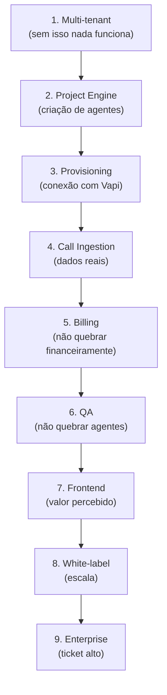

# 10. Roadmap Técnico

[← Guardrails e QA](09_guardrails_qa.md) | [Índice](README.md) | [Go-to-Market →](11_go_to_market.md)

---

## 🗺️ Visão Geral das Fases

```mermaid
gantt
    title Roadmap de Construção (12 meses)
    dateFormat  YYYY-MM-DD
    
    section Fase 1 — Foundation
    Identity & Multi-tenant     :a1, 2026-03-01, 2w
    Project Engine              :a2, after a1, 2w
    Vapi Provisioning           :a3, after a2, 2w
    Call Ingestion              :a4, after a3, 2w
    
    section Fase 2 — Controle
    Billing Engine              :b1, after a4, 2w
    Entitlements & Rate Limit   :b2, after b1, 1w
    QA Pipeline                 :b3, after b2, 2w
    Frontend Core (LiveView)    :b4, after b3, 3w
    
    section Fase 3 — Escala
    White-label                 :c1, after b4, 2w
    Outbound / Campaigns        :c2, after c1, 2w
    Integrações CRM             :c3, after c2, 2w
    Enterprise Features         :c4, after c3, 2w
```

---

## 📋 Fase 1 — Core & Orquestração (Meses 1–3)

> Sem isso **nada funciona**.

### Sprint 1: Identity & Multi-Tenant (2 sem)
- [ ] Schema: users, tenants, partners, memberships
- [ ] Migrations
- [ ] phx.gen.auth
- [ ] Plugs: LoadTenant, AuthorizeTenantAccess
- [ ] Policy engine básico
- [ ] Testes de isolamento multi-tenant

### Sprint 2: Project Engine (2 sem)
- [ ] Schema: projects, project_types, project_versions, deployments
- [ ] ProjectTypeRegistry (5 types)
- [ ] ConfigRenderer (template → config final)
- [ ] Modo Locked vs Advanced
- [ ] Versionamento com snapshot

### Sprint 3: Vapi Provisioning (2 sem)
- [ ] HTTP Client (Finch/Req)
- [ ] Provisioning service completo
- [ ] Criar Tools → Structured Output → Assistant → Phone Number
- [ ] Mapeamento IDs local
- [ ] Provisioning logs + error handling
- [ ] Idempotência

### Sprint 4: Call Ingestion (2 sem)
- [ ] Webhook endpoint (`POST /webhooks/vapi`)
- [ ] Processar `end-of-call-report`
- [ ] Processar `tool-calls`
- [ ] Processar `status-update`
- [ ] Salvar calls, transcripts, leads
- [ ] Cost engine
- [ ] Usage tracking

---

## 📋 Fase 2 — Controle (Meses 3–6)

> Sem isso **você quebra financeiramente**.

### Sprint 5: Billing Engine (2 sem)
- [ ] Schema: plans, subscriptions, usage_daily, invoices, billable_events
- [ ] Entitlements module
- [ ] Overage calculation
- [ ] Budget cap + bloqueio automático
- [ ] Rate limiting

### Sprint 6: QA Pipeline (2 sem)
- [ ] Static validator
- [ ] Eval suite (testes por project type)
- [ ] Deploy gate
- [ ] qa_suites + qa_runs
- [ ] Rollback seguro

### Sprint 7-8: Frontend Core (3 sem)
- [ ] Router com 3 live_sessions (tenant, partner, admin)
- [ ] WizardLive (state machine + draft)
- [ ] DashboardLive (realtime via PubSub)
- [ ] CallsLive + LeadsLive
- [ ] EditorLive (locked + advanced)
- [ ] BillingLive

---

## 📋 Fase 3 — Escala (Meses 6–12)

> Ativa **crescimento exponencial**.

### Sprint 9: White-Label + Partners
- [ ] Partner hierarchy
- [ ] Branding customizado
- [ ] SubTenantsLive
- [ ] WholesaleBillingLive
- [ ] Billing por parceiro

### Sprint 10: Outbound / Campaigns
- [ ] Campaign lifecycle
- [ ] campaign_leads tracking
- [ ] Opt-out guardrails
- [ ] CampaignsLive
- [ ] Voicemail detection

### Sprint 11: Integrações
- [ ] Webhook tools (CRM)
- [ ] Calendar connectors
- [ ] Payment connectors (PIX)
- [ ] Credentials encrypted (Cloak)
- [ ] Add-ons system

### Sprint 12: Enterprise
- [ ] Audit logs completo
- [ ] Admin panel (AllTenantsLive, SystemHealthLive)
- [ ] WebhookLogsLive, JobsMonitorLive
- [ ] BYOK/BYOC
- [ ] API pública futura

---

## 🏗️ Ordem de Construção (Regra de Ouro)



---

## ⚙️ Ciclo de Desenvolvimento

```
Build 2 semanas → Validar 2 semanas → Ajustar 2 semanas
```

> **Não ficar 6 meses escondido.** Lançar com clientes reais na Fase 1.

---

## 🚨 Riscos por Fase

| Fase | Risco Principal | Mitigação |
|------|----------------|-----------|
| 1 | Arquitetura errada no início | Seguir blueprint, testar isolamento |
| 2 | Explosão de custo sem controle | Budget cap + entitlements ANTES de escalar |
| 3 | Complexidade de white-label | Começar simples (comissão) antes de wholesale |

---

[← Guardrails e QA](09_guardrails_qa.md) | [Índice](README.md) | [Go-to-Market →](11_go_to_market.md)
