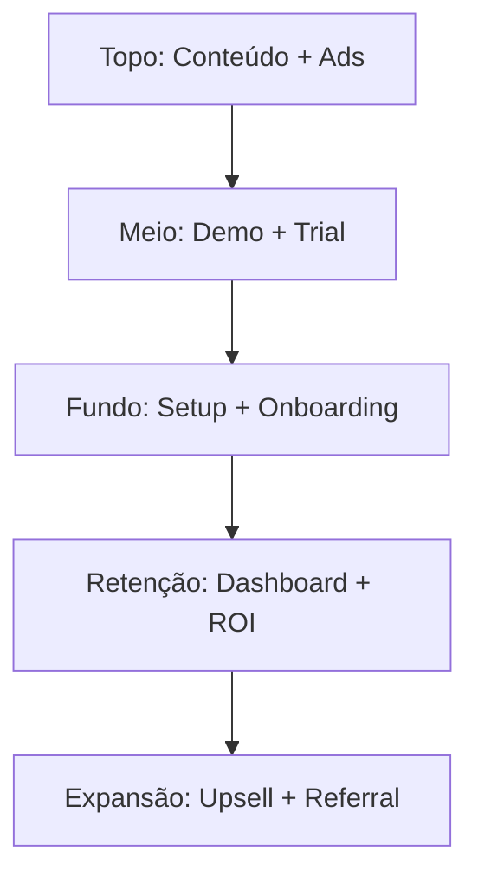
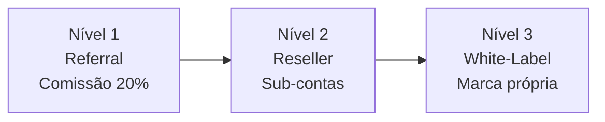

# 11. Estratégia Go-to-Market

[← Roadmap Técnico](10_roadmap_tecnico.md) | [Índice](README.md) | [Integrações Vapi →](12_integracoes_vapi.md)

---

## 🎯 ICP (Perfil de Cliente Ideal)

### Fase 1 — Clientes Diretos

| Critério | Detalhe |
|----------|---------|
| **Segmento** | Clínicas, consultórios, imobiliárias, escritórios |
| **Porte** | 1–50 funcionários |
| **Dor** | Perdem ligações, atendimento lento, leads desorganizados |
| **Ticket** | R$ 997–1.497/mês |
| **Ciclo de venda** | 7–14 dias |

### Fase 2 — Parceiros (White-Label)

| Critério | Detalhe |
|----------|---------|
| **Segmento** | Agências de tráfego, consultores comerciais |
| **Porte** | 10–50 clientes na carteira |
| **Dor** | Querem oferecer IA sem construir |
| **Ticket** | R$ 400–600/tenant |
| **Escala** | 10–30 clientes por agência |

---

## 📈 Funil de Aquisição

---

## 🗓️ Estratégia por Fase

### Meses 1–3: Agência First

| Ação | Canal |
|------|-------|
| Prospecção direta (cold outreach) | LinkedIn, WhatsApp |
| Cases gratuitos / desconto | 3–5 clientes piloto |
| Conteúdo educativo | Instagram, YouTube, blog |
| Meta: 10–15 clientes | Validar templates e pricing |

### Meses 3–6: Híbrido

| Ação | Canal |
|------|-------|
| Lançar plataforma self-serve | Site + wizard |
| Marketing "Crie seu agente em 15 min" | Ads, content |
| Parcerias iniciais com agências | 2–3 parceiros |
| Meta: 30–50 clientes | Validar onboarding automático |

### Meses 6–12: Escala

| Ação | Canal |
|------|-------|
| White-label ativo | Programa de parceiros |
| Outbound para empresas médias | SDR + DFY |
| Eventos / webinars | Autoridade no nicho |
| Meta: 80–150 clientes | Receita previsível |

---

## 🧠 Posicionamento (Como comunicar)

### ❌ Não diga
- "Plataforma de agentes com orchestration"
- "AI Agent Builder"
- "LLM-powered voice assistant"

### ✅ Diga
- "Secretária virtual inteligente que atende 24h"
- "Nunca mais perca uma ligação"
- "SDR automático que qualifica leads por você"
- "Agendamento automático por voz"
- "Reduza custos com atendimento inteligente"

---

## 💰 Modelo de Aquisição por Canal

| Canal | CAC estimado | LTV/CAC |
|-------|-------------|---------|
| Indicação / Referral | R$ 0–100 | 50:1+ |
| Conteúdo orgânico | R$ 100–300 | 15:1 |
| LinkedIn outbound | R$ 200–500 | 8:1 |
| Google Ads | R$ 300–800 | 5:1 |
| Parceiros / White-label | R$ 0 (eles vendem) | ∞ |

---

## 🔄 Estratégia de Retenção

| Ação | Frequência |
|------|-----------|
| Dashboard com ROI claro | Sempre visível |
| Review mensal de performance | Mensal |
| Alertas automáticos | Contínuo |
| Upsell de add-ons | Trimestral |
| NPS automatizado | Semestral |

---

## 🤝 Programa de Parceiros

| Nível | Requisito | Benefício |
|-------|-----------|-----------|
| Referral | Indicar clientes | 20% recorrente |
| Reseller | 5+ clientes ativos | Sub-contas + billing separado |
| White-label | 15+ clientes | Marca própria + domínio custom |

---

## 🏆 Vantagem Competitiva Sustentável

1. **Templates brasileiros** validados por vertical
2. **Guardrails** que reduzem suporte a quase zero
3. **Dashboard de ROI** que justifica renovação
4. **QA automático** que previne regressão
5. **Multi-modelo de negócio** na mesma infra

---

[← Roadmap Técnico](10_roadmap_tecnico.md) | [Índice](README.md) | [Integrações Vapi →](12_integracoes_vapi.md)
