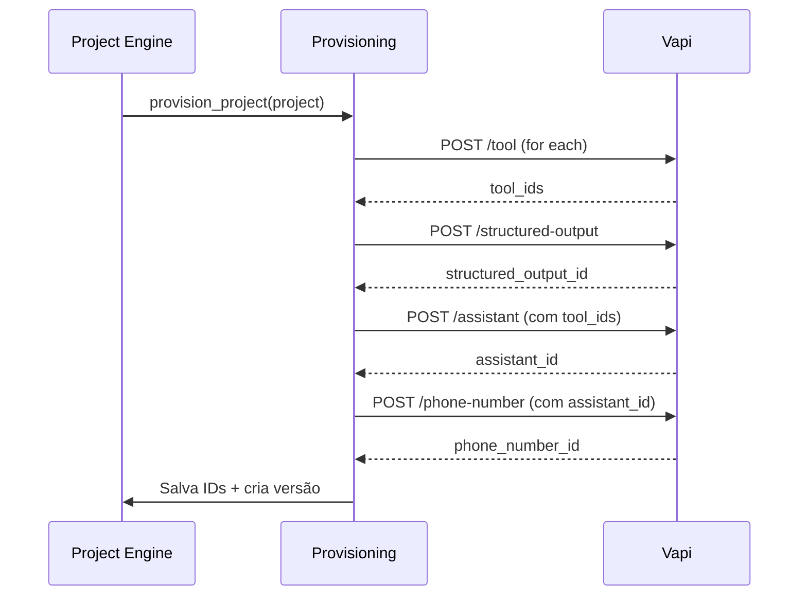

# 12. Integrações e API Vapi

[← Go-to-Market](11_go_to_market.md) | [Índice](README.md) | [Frontend LiveView →](13_frontend_liveview.md)

---

## 🔗 Endpoints Vapi que Você Consome

| Endpoint | Uso | Quando |
|----------|-----|--------|
| `POST /assistant` | Criar agente | Provisioning |
| `PATCH /assistant/{id}` | Atualizar (partial_update) | Deploy, rollback |
| `POST /tool` | Criar ferramenta | Provisioning |
| `POST /structured-output` | Criar extração de dados | Provisioning |
| `POST /phone-number` | Vincular número Twilio/Telnyx | Provisioning |
| `POST /campaign` | Criar campanha outbound | Outbound |
| `GET /campaign/{id}` | Monitorar campanha | Dashboard |
| `POST /eval/run` | Rodar testes QA | Deploy gate |
| `GET /call` | Fallback de ingestão (polling) | Backup |
| `GET /call/{id}` | Detalhes de chamada | Debug |

---

## 📦 Payload Completo do Assistant

```json
{
  "name": "Clínica Bella - Atendimento",
  "firstMessage": "Olá, como posso ajudar?",
  "firstMessageMode": "assistant-speaks-first",
  "transcriber": {
    "provider": "deepgram",
    "model": "nova-2",
    "language": "pt"
  },
  "model": {
    "provider": "openai",
    "model": "gpt-4o",
    "messages": [
      { "role": "system", "content": "...prompt renderizado..." }
    ],
    "toolIds": ["tool_abc"]
  },
  "voice": {
    "provider": "11labs",
    "voiceId": "burt"
  },
  "analysisPlan": {
    "structuredDataPlan": {
      "enabled": true,
      "schema": { }
    }
  },
  "serverUrl": "https://api.seusistema.com/webhooks/vapi",
  "serverMessages": ["end-of-call-report", "tool-calls", "status-update"],
  "recordingEnabled": true,
  "voicemailDetection": { "enabled": true, "provider": "vapi" },
  "silenceTimeoutSeconds": 30,
  "maxDurationSeconds": 900
}
```

### Campos Críticos

| Campo | Por quê |
|-------|---------|
| `serverUrl` | Sem isso não recebe webhooks |
| `serverMessages` | Define quais eventos chega |
| `maxDurationSeconds` | Guardrail de custo (600–900s) |
| `silenceTimeoutSeconds` | Evita chamada travada (20–40s) |
| `voicemailDetection` | Obrigatório para outbound |
| `recordingEnabled` | Compliance Brasil |

---

## 📥 Webhooks que Você Recebe

### `end-of-call-report`

```json
{
  "message": {
    "type": "end-of-call-report",
    "call": {
      "id": "call_123",
      "duration": 45,
      "cost": 0.08,
      "endedReason": "customer-ended-call"
    },
    "analysis": {
      "structuredData": {
        "name": "João",
        "phone": "11999999999",
        "qualified": true
      }
    },
    "artifact": {
      "messages": [
        {"role": "assistant", "content": "..."},
        {"role": "user", "content": "..."}
      ]
    }
  }
}
```

**Extrair**: `call.id`, `call.duration`, `call.cost`, `call.endedReason`, `analysis.structuredData`, `artifact.messages`

### `tool-calls`

```json
{
  "message": {
    "type": "tool-calls",
    "toolCallList": [{
      "id": "call_123",
      "function": {
        "name": "create_lead",
        "arguments": { "name": "João", "phone": "11999999999" }
      }
    }]
  }
}
```

**Resposta obrigatória**:
```json
{
  "results": [{
    "toolCallId": "call_123",
    "result": "Lead criado com sucesso"
  }]
}
```

### `status-update`
```json
{ "message": { "type": "status-update", "status": "in-progress" } }
```
Usar para incrementar/decrementar `active_calls`.

---

## 🔧 Endpoints Internos (Phoenix)

### Auth & Tenant
```
POST   /api/auth/login
POST   /api/auth/register
GET    /api/me
POST   /api/tenants
GET    /api/tenants/:id
PATCH  /api/tenants/:id
```

### Projects
```
POST   /api/projects
GET    /api/projects/:id
PATCH  /api/projects/:id
DELETE /api/projects/:id
POST   /api/projects/:id/provision
POST   /api/projects/:id/deploy
POST   /api/projects/:id/rollback/:version
```

### Calls & Leads
```
GET    /api/projects/:id/calls
GET    /api/projects/:id/leads
GET    /api/calls/:id
```

### Campaigns
```
POST   /api/projects/:id/campaigns
GET    /api/projects/:id/campaigns
```

### Usage & Billing
```
GET    /api/tenants/:id/usage
GET    /api/tenants/:id/billing
```

### Webhooks
```
POST   /webhooks/vapi              (end-of-call-report, status-update)
POST   /webhooks/vapi/tool-calls   (tool-calls)
```

---

## 🏗️ Fluxo de Provisionamento



---

## 🔐 BYOK/BYOC Providers

| Provider | Phone Number | Voice | Notas |
|----------|-------------|-------|-------|
| **Twilio** | `provider: "twilio"`, `credentialId` | — | BYOC principal BR |
| **Telnyx** | `provider: "telnyx"`, `credentialId` | — | Alternativa |
| **ElevenLabs** | — | `provider: "11labs"`, `voiceId` | Voice principal |
| **OpenAI** | — | `provider: "openai"`, nome da voz | Alternativa |

---

## 🧱 Estrutura de Módulos Elixir

```
AiPlatform.Vapi
  ├── Client          # HTTP client (Finch/Req)
  ├── Assistants      # CRUD assistants
  ├── Tools           # CRUD tools
  ├── StructuredOutputs
  ├── PhoneNumbers
  ├── Campaigns
  ├── Provisioning    # Orquestração completa
  └── Webhooks        # Parse + routing de payloads
```

---

[← Go-to-Market](11_go_to_market.md) | [Índice](README.md) | [Frontend LiveView →](13_frontend_liveview.md)
