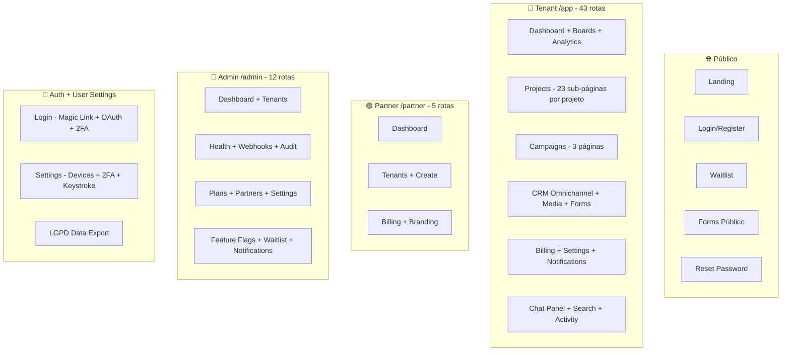
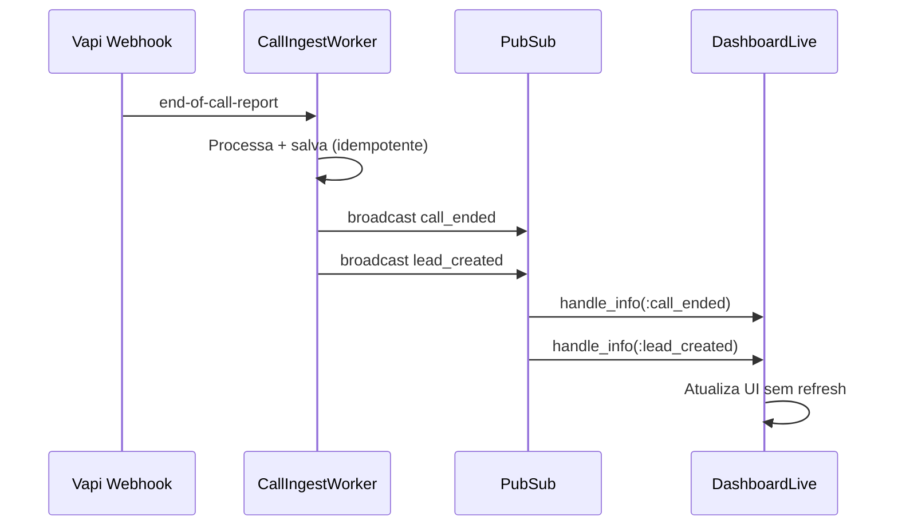

# 13. Frontend LiveView

[← Integrações Vapi](12_integracoes_vapi.md) | [Índice](README.md)

---

## 🏗️ Arquitetura de Rotas — 82 LiveViews em 5 Áreas



---

## 🔐 Router (Isolamento por live_session)

```
3 live_sessions isoladas:

:tenant  → /app/*     (on_mount: AuthOnMount + TenantHook + AuditHook + ErrorLoggerHook + EntitlementGuard)
:partner → /partner/* (on_mount: AuthOnMount + require_partner_role)
:admin   → /admin/*   (on_mount: AuthOnMount + require_global_admin)
```

> **Regra**: `host` determina partner (white-label via WhiteLabel plug); `sessão` determina tenant.

---

## 📋 Sub-Páginas por Projeto (23 telas)

Cada projeto tem acesso a:

| Rota | LiveView | Função |
|------|----------|--------|
| `/app/projects/:id` | `ProjectDashboardLive` | Dashboard com KPIs realtime |
| `.../edit` | `ProjectEditorLive` | Editor locked/advanced mode |
| `.../calls` | `CallsListLive` | Histórico de chamadas paginado |
| `.../calls/monitor` | `CallMonitorLive` | Monitor em tempo real |
| `.../calls/:id/listen` | `CallListenLive` | Escuta ao vivo + transcrição |
| `.../leads` | `LeadsListLive` | Leads qualificados |
| `.../workflow` | `WorkflowBuilderLive` | Editor visual drag-and-drop |
| `.../workflow/analytics` | `WorkflowHeatmapLive` | Heatmap de fluxo |
| `.../knowledge-base` | `KbManagerLive` | Upload/manage files RAG |
| `.../knowledge-graph` | `KnowledgeGraphLive` | Visualização GraphRAG |
| `.../widget` | `WidgetSettingsLive` | Config widget embeddable |
| `.../voice` | `VoiceSelectorLive` | Seletor de voz |
| `.../sms` | `SmsInboxLive` | Inbox SMS por projeto |
| `.../versions` | `VersionsLive` | Histórico com diff visual |
| `.../qa` | `QaDashboardLive` | QA/Evals com scores |
| `.../squads` | `SquadEditorLive` | Squads multi-agent |
| `.../chat` | `ChatLive` | Chat com agente |
| `.../experiments` | `ExperimentsLive` | A/B testing |
| `.../tools` | `CustomToolsLive` | Ferramentas custom |
| `.../tuning` | `TuningSuggestionsLive` | Sugestões auto-tuning IA |
| `.../simulator` | `SimulatorLive` | Simulador de conversa |

---

## ⚡ Padrão Realtime (PubSub — 30+ tópicos)



**Tópicos por escopo:**
- `calls` — eventos de chamadas
- `campaigns` — status de campanhas
- `leads` — novos leads
- `projects` — mudanças de projeto
- `billing` — alertas de billing
- `notifications` — notificações in-app
- `omnichannel` — threads/mensagens
- `audit_logs` — trail de auditoria
- `system` — health do sistema

---

## 🔧 JS Hooks (15 hooks)

| Hook | Uso |
|------|-----|
| ErrorLogger | Captura `window.onerror` → backend |
| AudioRecorder | Gravação de áudio p/ transcrição |
| ChartHook | Chart.js integrado |
| ClipboardCopy | Copiar para clipboard |
| ConfettiHook | Animação pós-ação |
| DeviceFingerprint | Fingerprint de dispositivo (CPU, RAM, screen) |
| KeystrokeRhythm | Biometria comportamental |
| LiveTopicsChart | Chart de tópicos realtime |
| SortableList | Drag-and-drop (SortableJS) |
| VoiceRecorder | Gravação para voice clone |
| WorkflowCanvas | Canvas de workflow (D3.js/SVG) |

> **Regra**: Hooks sem lógica de negócio. Só UI.

---

## 🎨 Componentes Reutilizáveis

| Componente | Uso |
|-----------|-----|
| `<.page_header>` | Header padronizado com breadcrumbs (13+ páginas) |
| `<.metric_card>` | Cards de KPI no dashboard |
| `<.status_badge>` | Status com cor |
| `<.data_table>` | Tabela com paginação, filtros |
| `<.progress_bar>` | Uso de minutos / budget |
| `<.slide_over>` | Detalhes de call/lead |
| `<.wizard_step>` | Passos do wizard |

---

## 🔍 Funcionalidades Globais

| Feature | Descrição |
|---------|-----------|
| **Search** | Busca paralela em 9 tipos (projects, calls, campaigns, leads, KB, members, forms, media, contacts) |
| **Chat LLM** | Painel lateral com 80+ tools, streaming, code highlight, multi-provider |
| **Notifications** | Centro de notificações in-app com contador |
| **Activity Feed** | Timeline com 50 ações humanizadas + PubSub |
| **Analytics Boards** | Dashboards customizáveis com widgets drag-and-drop |
| **Telegram Bot** | 7 comandos: /calls, /leads, /campaigns, /status, /analytics, /help |

---

## 🛡️ Features de Segurança no Frontend

| Feature | Implementação |
|---------|--------------|
| Sudo Mode | Re-auth em rotas sensíveis (2FA setup, keystroke) |
| EntitlementGuard | on_mount hook bloqueia LiveViews sem permissão do plano |
| RoleGuard | on_mount hook verifica RBAC (admin/operator/viewer) em 11+ LiveViews |
| AuditHook | on_mount captura TODOS handle_event → audit trail |

---

## 📐 Contagem Final

| Tipo | Quantidade |
|------|-----------:|
| LiveViews | **82** |
| Controllers | **15+** |
| Rotas Públicas | ~10 |
| Rotas /app | ~43 |
| Rotas /admin | ~12 |
| Rotas /partner | 5 |
| Rotas API | ~6 |
| **Total** | **~90 rotas** |

---

[← Integrações Vapi](12_integracoes_vapi.md) | [Índice](README.md)
