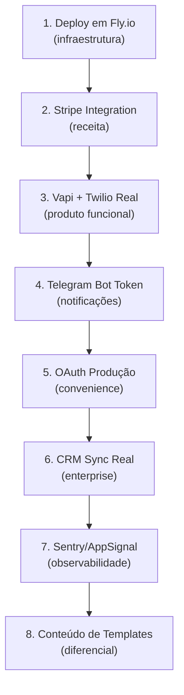

# 14. Pendências — Gap Analysis

[← Frontend LiveView](13_frontend_liveview.md) | [Índice](README.md)

---

> **Este documento lista tudo que está no plano de negócio mas ainda NÃO foi implementado no projeto Elixir.**
> Prioridade: 🔴 Crítico (bloqueia produção) | 🟡 Importante (afeta escala) | 🟢 Nice-to-have

---

## 🔴 Pendências Críticas (Bloqueia Go-Live)

### 1. Pagamentos / Stripe Integration
O plano prevê cobrança real de clientes, mas **nenhuma integração de pagamento está implementada**. O schema `Billing` existe (plans, subscriptions, usage), mas a cobrança real não acontece.

| Item | Status |
|------|--------|
| Stripe Checkout / Portal | ❌ Não implementado |
| Stripe Webhooks (payment_succeeded, etc) | ❌ Não implementado |
| Cobrança real de overage | ❌ Lógica só calcula, não cobra |
| Invoices reais | ❌ Schema existe, sem PDF/email |
| Downgrade/Upgrade de plano | ❌ Apenas lógica interna |

**Prioridade:** 🔴 — Sem isso não há receita.

---

### 2. OAuth Google/GitHub em Produção
O controller existe como stub, mas falta configurar providers em produção (client_id, secret, callbacks).

| Item | Status |
|------|--------|
| `OauthController` existe | ✅ |
| Provider config em produção | ❌ |

**Prioridade:** 🟡 — Login funciona sem OAuth (magic link + senha).

---

### 3. Deploy em Produção
O plano prevê deploy em Fly.io com GitHub Actions, mas nenhuma configuração de CI/CD existe.

| Item | Status |
|------|--------|
| `fly.toml` | ❌ |
| GitHub Actions workflow | ❌ |
| Variáveis de ambiente de produção | ❌ |
| SSL/domínio próprio | ❌ |
| PostgreSQL managed (Fly/Neon) | ❌ |

**Prioridade:** 🔴 — Sem isso não vai ao ar.

---

## 🟡 Pendências Importantes (Afeta Escala)

### 4. Provisionamento Real na Vapi
O `Vapi.Client` existe com retry e circuit breaker, e o `Provisioning` service existe, mas o fluxo real de criação de assistant → tools → phone number precisa ser testado e validado em ambiente Vapi real.

| Item | Status |
|------|--------|
| `Vapi.Client` com retry/circuit breaker | ✅ |
| `Provisioning` service | ✅ |
| VapiResource (mapeamento local) | ✅ |
| Teste real com conta Vapi | ❌ Não testado em produção |
| Números telefônicos BR (Twilio import) | ❌ Não configurado |

**Prioridade:** 🟡 — Infra existe, falta validar com API real.

---

### 5. SMS Real (Twilio)
O módulo `SmsChannel` e o `TwilioWebhookController` existem, mas a integração real com Twilio precisa de account_sid + auth_token configurados.

| Item | Status |
|------|--------|
| `SmsChannel` module | ✅ |
| `TwilioWebhookController` | ✅ |
| `SmsInboxLive` | ✅ |
| Credenciais Twilio em produção | ❌ |
| Teste de envio real | ❌ |

**Prioridade:** 🟡

---

### 6. Telegram Bot em Produção
O bot é completo (GenServer, 7 comandos, webhook mode), mas precisa de `BOT_TOKEN` e configuração do webhook URL.

| Item | Status |
|------|--------|
| Bot GenServer + polling/webhook | ✅ |
| 7 comandos | ✅ |
| Notifier com 8+ eventos | ✅ |
| RateLimiter + Session | ✅ |
| Token de bot em produção | ❌ |
| Webhook URL configurado | ❌ |

**Prioridade:** 🟡

---

### 7. Integração CRM Real (HubSpot, Pipedrive)
O framework `Integrations` existe com 8 definitions, mas a lógica de sincronia real com CRMs não existe.

| Item | Status |
|------|--------|
| IntegrationDefinition (8 providers) | ✅ |
| TenantIntegration (enable/disable) | ✅ |
| IntegrationsLive | ✅ |
| Sync real de leads → HubSpot | ❌ |
| Sync real de leads → Pipedrive | ❌ |
| Webhook real → Zapier/Make | ✅ (via outbound webhooks) |

**Prioridade:** 🟡

---

### 8. Voice Clone Real (ElevenLabs)
O módulo `VoiceClone` e `VoiceCloneLive` existem, mas a integração real com ElevenLabs API precisa de API key.

| Item | Status |
|------|--------|
| `VoiceClone` module | ✅ |
| `VoiceCloneLive` | ✅ |
| `VoiceSelectorLive` | ✅ |
| ElevenLabs API key em produção | ❌ |
| Teste de clone real | ❌ |

**Prioridade:** 🟡

---

### 9. Error Tracking Externo (Sentry/AppSignal)
O sistema tem seu próprio ErrorLogger (4 camadas), mas falta integração com serviço externo para alertas em produção.

| Item | Status |
|------|--------|
| ErrorLogger GenServer | ✅ |
| Erlang :logger handler | ✅ |
| Frontend JS hook | ✅ |
| Sentry/AppSignal integration | ❌ |

**Prioridade:** 🟡

---

## 🟢 Nice-to-Have (Melhorias Futuras)

### 10. Multi-Idioma (i18n)
O plano menciona `Multi-Language` como add-on. O `Config.Multilingual` existe mas o frontend é 100% português.

| Item | Status |
|------|--------|
| `Config.Multilingual` | ✅ |
| Gettext/i18n nas LiveViews | ❌ |
| Landing page em inglês | ❌ |

**Prioridade:** 🟢

---

### 11. Calendário / Scheduling Real
O plano menciona integrações com calendário (Google Calendar, Cal.com).

| Item | Status |
|------|--------|
| Integração Google Calendar | ❌ |
| Integração Cal.com | ❌ |
| Agendamento real (não só captura de lead) | ❌ |

**Prioridade:** 🟢

---

### 12. PIX / Payment Link Generation
O plano de cobrança menciona gerar links de pagamento. Não implementado.

| Item | Status |
|------|--------|
| Gerar link PIX | ❌ |
| Integração com gateway BR | ❌ |

**Prioridade:** 🟢

---

### 13. App Mobile / PWA
Não está no plano imediato, mas eventualmente necessário para escala.

| Item | Status |
|------|--------|
| PWA manifest | ❌ |
| Push notifications | ❌ |

**Prioridade:** 🟢

---

### 14. Marketplace de Templates
O plano prevê marketplace controlado de templates. O módulo `Templates` existe como biblioteca interna.

| Item | Status |
|------|--------|
| `Templates` module (biblioteca interna) | ✅ |
| Marketplace com compra/venda | ❌ |
| Templates por nicho BR | ❌ (framework existe, conteúdo não) |

**Prioridade:** 🟢

---

### 15. API Pública REST/GraphQL
O plano menciona API pública para clientes enterprise. Atualmente só existe MCP e webhooks.

| Item | Status |
|------|--------|
| MCP Tools (34 tools) | ✅ |
| API REST documentada | ❌ (OpenAPI spec existe, endpoints limitados) |
| API GraphQL | ❌ |
| Rate limiting por API key | ✅ |

**Prioridade:** 🟢

---

## 📊 Resumo de Pendências

| Prioridade | Itens | % do Plano |
|------------|-------|------------|
| 🔴 Crítico | 3 itens (Pagamentos, Deploy, OAuth prod) | ~5% |
| 🟡 Importante | 6 itens (Vapi real, SMS, Telegram, CRM, Voice, Sentry) | ~10% |
| 🟢 Nice-to-have | 6 itens (i18n, Calendar, PIX, PWA, Marketplace, API) | ~10% |
| ✅ **Implementado** | **~75% do plano** | **75%** |

> **Conclusão**: O motor técnico está **75% construído**. As pendências críticas são majoritariamente de **configuração de produção** (contas, chaves, deploy), não de código. O código e arquitetura cobrem virtualmente todas as features do plano de negócio.

---

## 🗺️ Ordem de Resolução Recomendada

---

[← Frontend LiveView](13_frontend_liveview.md) | [Índice](README.md)
