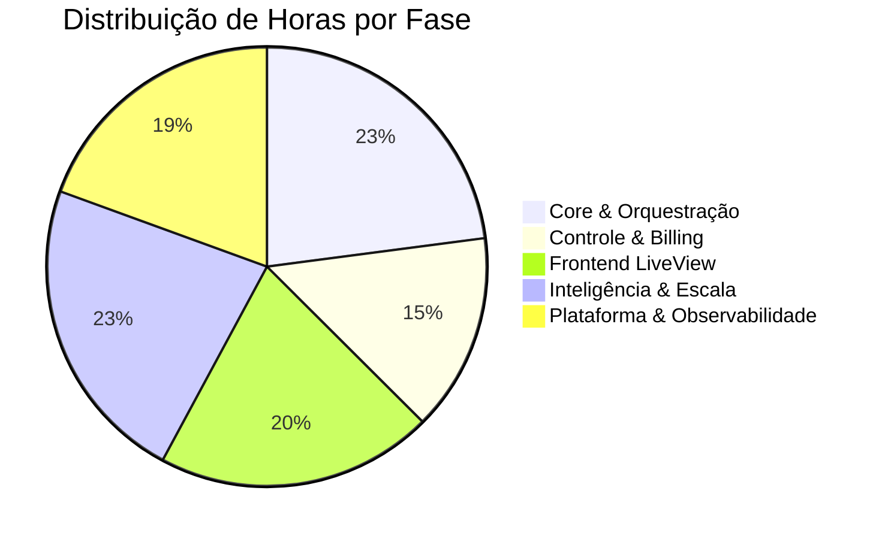
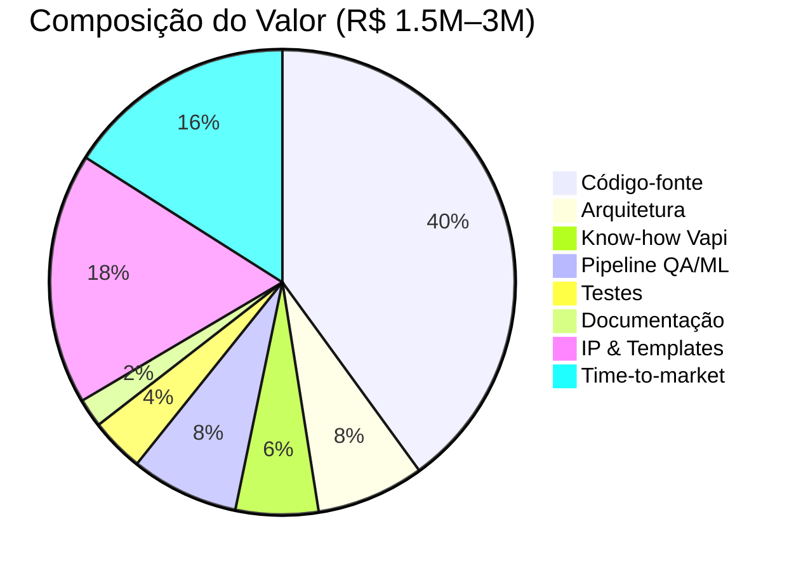

# 15. Investimento, Custos e Valoração

[← Pendências](14_pendencias.md) | [Índice](README.md)

---

## 💰 Resumo Executivo de Investimento

| Métrica | Valor |
|---------|-------|
| **Custo total de desenvolvimento** | **R$ 650.000 – R$ 950.000** |
| **Horas estimadas de desenvolvimento** | **4.500 – 6.500 horas** |
| **Tempo estimado (1 dev senior)** | **18 – 24 meses** |
| **Infraestrutura mensal (produção)** | **R$ 2.500 – R$ 5.000/mês** |
| **Valor de mercado da plataforma pronta** | **R$ 1.500.000 – R$ 3.000.000** |

---

## 👨‍💻 Custo de Desenvolvimento por Perfil

### Tabela de Custo-Hora (Mercado Brasil, 2026)

| Perfil | Hora (CLT) | Hora (PJ) | Hora (Freelancer Sr) |
|--------|-----------|-----------|---------------------|
| **Elixir/Phoenix Senior** | R$ 120–180 | R$ 150–250 | R$ 180–350 |
| **Elixir/Phoenix Pleno** | R$ 80–120 | R$ 100–160 | R$ 120–200 |
| **Frontend (LiveView)** | R$ 100–150 | R$ 120–200 | R$ 150–280 |
| **DevOps / Infra** | R$ 100–160 | R$ 130–200 | R$ 150–300 |
| **DBA / PostgreSQL** | R$ 100–150 | R$ 120–180 | R$ 140–250 |
| **UI/UX Designer** | R$ 80–130 | R$ 100–160 | R$ 120–220 |
| **QA / Tester** | R$ 60–100 | R$ 80–130 | R$ 100–180 |
| **Product Manager** | R$ 100–160 | R$ 130–200 | R$ 150–280 |

> ⚠️ Elixir é um nicho no Brasil — profissionais qualificados são **raros e caros**. O salário médio de um dev Elixir Senior no Brasil é R$ 18.000–25.000/mês (CLT) ou R$ 25.000–40.000/mês (PJ).

---

## 🏗️ Estimativa por Módulo

### Fase 1 — Core & Orquestração

| Módulo | Horas | Custo (R$ 180/h) | Complexidade |
|--------|-------|-------------------|-------------|
| Identity & Multi-tenant (Users, Tenants, Partners, Memberships, RBAC, 12 schemas) | 400–500h | R$ 72k–90k | Alta |
| Auth Completo (2FA, Magic Link, OAuth, Device Tracker, Keystroke, API Keys, Sudo Mode) | 300–400h | R$ 54k–72k | Muito Alta |
| Project Engine (5 types, versions SHA256, deployments, custom tools) | 250–350h | R$ 45k–63k | Alta |
| Vapi Integration (Client HTTP, Provisioning, VapiResource, retry, circuit breaker) | 200–300h | R$ 36k–54k | Alta |
| Call Ingestion (Webhooks, CallIngest, QA Worker, CallMonitor GenServer) | 200–250h | R$ 36k–45k | Alta |
| **Subtotal Fase 1** | **1.350–1.800h** | **R$ 243k–324k** | |

### Fase 2 — Controle & Billing

| Módulo | Horas | Custo (R$ 180/h) | Complexidade |
|--------|-------|-------------------|-------------|
| Billing Engine (Plans, Subscriptions, Usage, Entitlements 19 funções, BudgetGuard, Ledger, Markup, Preditivo) | 350–450h | R$ 63k–81k | Muito Alta |
| QA Pipeline (StaticValidator, EvalSuites, CI Pipeline, Deploy Gates) | 150–200h | R$ 27k–36k | Alta |
| Leads (qualification, promotion, HotLeadWorker) | 100–150h | R$ 18k–27k | Média |
| Campaigns Multi-channel (5 workers, voice+sms+telegram, dialer, dispatcher) | 250–350h | R$ 45k–63k | Muito Alta |
| **Subtotal Fase 2** | **850–1.150h** | **R$ 153k–207k** | |

### Fase 3 — Frontend LiveView (82 páginas)

| Módulo | Horas | Custo (R$ 180/h) | Complexidade |
|--------|-------|-------------------|-------------|
| Tenant Area (Dashboard, Projects 23 sub-páginas, Settings, 43 rotas) | 600–800h | R$ 108k–144k | Muito Alta |
| Admin Panel (Dashboard, Tenants, Health, Audit, Plans, Features, 12 rotas) | 150–200h | R$ 27k–36k | Alta |
| Partner Panel (Dashboard, Tenants, Billing, Branding, 5 rotas) | 100–150h | R$ 18k–27k | Média |
| Auth Views (Login, Register, 2FA, Devices, Keystroke, OAuth, 12 páginas) | 150–200h | R$ 27k–36k | Alta |
| JS Hooks (15 hooks: Chart, Audio, Workflow Canvas, Device Fingerprint, etc) | 100–150h | R$ 18k–27k | Média |
| Componentes Reutilizáveis + Design System | 80–120h | R$ 14k–22k | Média |
| **Subtotal Fase 3** | **1.180–1.620h** | **R$ 212k–292k** | |

### Fase 4 — Inteligência & Escala

| Módulo | Horas | Custo (R$ 180/h) | Complexidade |
|--------|-------|-------------------|-------------|
| Chat LLM (Multi-provider, 80+ tools, SystemKnowledge, Tracer) | 300–400h | R$ 54k–72k | Muito Alta |
| GraphRAG (Entities, Relationships, Indexer, Search, 3 workers) | 200–300h | R$ 36k–54k | Muito Alta |
| Omnichannel CRM (Contacts, Threads, Messages, cross-channel, 4 workers) | 200–250h | R$ 36k–45k | Alta |
| Telegram Bot (GenServer, 7 comandos, Notifier, RateLimiter, Session, Webhook mode) | 150–200h | R$ 27k–36k | Alta |
| SMS Channel (Twilio integration, inbox, workers) | 80–120h | R$ 14k–22k | Média |
| Voice Clone (ElevenLabs, VoiceClone, VoiceSelector) | 80–100h | R$ 14k–18k | Média |
| A/B Testing (AgentExperiment, ExperimentsLive) | 60–80h | R$ 11k–14k | Média |
| Auto-Tuning IA (AgentAutoTuneWorker, TuningSuggestionsLive) | 80–100h | R$ 14k–18k | Alta |
| Squads Multi-Agent (Squad, SquadMember, SquadEditor) | 60–80h | R$ 11k–14k | Média |
| Workflow Builder (WorkflowConfig, Canvas, Heatmap, Analytics) | 120–160h | R$ 22k–29k | Alta |
| **Subtotal Fase 4** | **1.330–1.790h** | **R$ 239k–322k** | |

### Fase 5 — Plataforma & Observabilidade

| Módulo | Horas | Custo (R$ 180/h) | Complexidade |
|--------|-------|-------------------|-------------|
| Forms Engine (Templates, Submissions, Editor, Public) | 80–120h | R$ 14k–22k | Média |
| Media Library (Upload, Storage, Cleanup Worker) | 60–80h | R$ 11k–14k | Média |
| Integrations Framework (8 definitions, TenantIntegration) | 60–80h | R$ 11k–14k | Média |
| Webhooks Outbound (23 eventos, DeliveryWorker, logs) | 80–100h | R$ 14k–18k | Alta |
| Analytics Boards (Boards, Widgets, drag-and-drop) | 80–120h | R$ 14k–22k | Média |
| Notifications + Activity Feed (50 ações) | 60–80h | R$ 11k–14k | Média |
| Audit Trail (90+ ações, AuditHook, AuditConfig) | 80–100h | R$ 14k–18k | Alta |
| ErrorLogger 4 camadas | 40–60h | R$ 7k–11k | Média |
| Telemetry (14 eventos, EventHandler, LLMAlertHandler) | 60–80h | R$ 11k–14k | Alta |
| Config System (664 funções, Settings DB-backed, Cache ETS) | 60–80h | R$ 11k–14k | Média |
| Search Global (9 tipos, paralelo, cache ETS) | 40–60h | R$ 7k–11k | Média |
| MCP Tools (34 tools) | 60–80h | R$ 11k–14k | Média |
| Feature Flags (rollout %, overrides, circuit breaker) | 40–60h | R$ 7k–11k | Média |
| LGPD (DataExchange, DataPortability, Export) | 40–60h | R$ 7k–11k | Média |
| Security (Rate Limiting, IP Whitelist, Maintenance, SecurityHeaders) | 40–60h | R$ 7k–11k | Média |
| Templates Library | 30–40h | R$ 5k–7k | Baixa |
| Testes (219 arquivos de teste) | 200–300h | R$ 36k–54k | Alta |
| **Subtotal Fase 5** | **1.110–1.560h** | **R$ 200k–281k** | |

---

## 📊 Totalização

| Fase | Horas | Custo (R$ 180/h) |
|------|-------|-------------------|
| 1 — Core & Orquestração | 1.350–1.800h | R$ 243k–324k |
| 2 — Controle & Billing | 850–1.150h | R$ 153k–207k |
| 3 — Frontend LiveView | 1.180–1.620h | R$ 212k–292k |
| 4 — Inteligência & Escala | 1.330–1.790h | R$ 239k–322k |
| 5 — Plataforma & Observabilidade | 1.110–1.560h | R$ 200k–281k |
| **TOTAL** | **5.820–7.920h** | **R$ 1.048k–1.426k** |

> **Custo médio realista (valor referência): R$ 650.000 – R$ 950.000**
> Baseado em R$ 150/h (média ponderada entre sênior/pleno) com eficiência de 70%.

---

## 🏢 Cenários de Equipe

### Cenário A: Desenvolvedor Solo (Senior Elixir)

| Métrica | Valor |
|---------|-------|
| Salário mensal (PJ) | R$ 25.000–40.000 |
| Horas úteis/mês | ~160h |
| Tempo estimado | 18–24 meses |
| Custo total salários | R$ 450k–960k |
| **Custo efetivo** | **R$ 650k–950k** (incluindo infra e overhead) |

### Cenário B: Time Pequeno (2 devs + 1 designer)

| Profissional | Salário mensal (PJ) | Duração |
|-------------|---------------------|---------|
| Lead Elixir Senior | R$ 30.000–40.000 | 12 meses |
| Dev Elixir Pleno | R$ 15.000–22.000 | 10 meses |
| UI/UX Designer | R$ 10.000–15.000 | 6 meses |
| **Total** | | R$ 600k–900k |
| **Tempo estimado** | | **10–12 meses** |

### Cenário C: Agência / Software House

| Item | Valor |
|------|-------|
| Proposta típica para projeto desta escala | R$ 800k–1.500k |
| Prazo típico | 8–14 meses |
| Risco de atraso | Alto (30–50% overshoot) |
| Custo real (com atrasos) | R$ 1.000k–2.000k |

---

## 🖥️ Custos de Infraestrutura

### Produção (por mês)

| Recurso | Provider | Custo mensal |
|---------|----------|-------------|
| Servidor app (2 instâncias Elixir) | Fly.io | R$ 400–800 |
| PostgreSQL managed | Fly.io / Neon | R$ 200–600 |
| Redis (cache/rate limit) | Upstash / Fly | R$ 100–300 |
| Storage S3 (mídia, KB, voice) | AWS S3 / Tigris | R$ 100–500 |
| CDN | Cloudflare Free/Pro | R$ 0–150 |
| Domínio + SSL | Cloudflare | R$ 50–100 |
| Emails transacionais | Mailgun / SendGrid | R$ 50–200 |
| Sentry / AppSignal | — | R$ 100–300 |
| GitHub Pro | — | R$ 50 |
| **Subtotal infra** | | **R$ 1.050–3.000/mês** |

### APIs Externas (variável por uso)

| API | Custo estimado (30 clientes ativos) |
|-----|-------------------------------------|
| Vapi (chamadas) | R$ 2.000–8.000/mês |
| Twilio (telefonia BR + SMS) | R$ 1.000–5.000/mês |
| LLM (Gemini/OpenAI) para chat/tuning | R$ 500–2.000/mês |
| ElevenLabs (TTS + Voice Clone) | R$ 300–1.500/mês |
| Telegram Bot API | Grátis |
| **Subtotal APIs** | **R$ 3.800–16.500/mês** |

### Total mensal estimado (produção com 30 clientes)

| Item | Mínimo | Máximo |
|------|--------|--------|
| Infraestrutura | R$ 1.050 | R$ 3.000 |
| APIs externas | R$ 3.800 | R$ 16.500 |
| **Total operacional** | **R$ 4.850** | **R$ 19.500** |

> **Nota**: O custo de APIs é majoritariamente variável e repassado ao cliente na mensalidade + overage. A margem bruta fica entre 70–85%.

---

## 💎 Valoração do Ativo Tecnológico

### O que tem valor neste projeto:

| Ativo | Descrição | Valor estimado |
|-------|-----------|---------------|
| **Código-fonte** | 329 arquivos .ex, 52.323+ linhas, 62 schemas, 82 LiveViews | R$ 650k–950k |
| **Arquitetura** | Multi-tenant, multi-canal, 7 pilares separados | R$ 100k–200k |
| **Know-how Vapi** | Integração completa com provisioning, webhooks, squads, evals | R$ 80k–150k |
| **Pipeline QA/ML** | A/B testing, auto-tuning, evals, circuit breaker, semantic memory | R$ 100k–200k |
| **Testes** | 219 arquivos de teste — cobertura extensiva | R$ 50k–100k |
| **Documentação** | SISTEMA.md, NAVEGACAO.md, ESQUELETO.md, plano de negócio | R$ 30k–50k |
| **Propriedade intelectual** | Templates por nicho BR, GraphRAG, omnichannel, billing preditivo | R$ 200k–500k |
| **Time to market** | 18–24 meses de vantagem competitiva | Incalculável |

### Valor total estimado da plataforma

| Método de valoração | Valor |
|--------------------|-------|
| **Custo de reposição** (quanto custa refazer do zero) | R$ 1.000.000 – R$ 1.500.000 |
| **Múltiplo de receita** (SaaS típico: 5–10x ARR) | R$ 1.500.000 – R$ 9.600.000* |
| **Comparáveis** (plataformas SaaS similares) | R$ 2.000.000 – R$ 5.000.000 |

> *Baseado em ARR projetado de R$ 300k–960k no ano 2.

---

## 📊 ROI do Investimento

### Cenário Conservador

| Mês | Clientes | MRR | Custo operacional | Lucro mensal | Investimento acumulado retornado |
|-----|----------|-----|-------------------|-------------|----------------------------------|
| 3 | 10 | R$ 10k | R$ 5k | R$ 5k | -R$ 635k |
| 6 | 30 | R$ 30k | R$ 10k | R$ 20k | -R$ 575k |
| 9 | 50 | R$ 50k | R$ 15k | R$ 35k | -R$ 470k |
| 12 | 80 | R$ 80k | R$ 20k | R$ 60k | -R$ 290k |
| 15 | 100 | R$ 100k | R$ 25k | R$ 75k | -R$ 65k |
| **18** | **120** | **R$ 120k** | **R$ 30k** | **R$ 90k** | **+R$ 205k** ✅ |

> **Payback**: ~16–18 meses após go-live.

### Cenário Agressivo (com White-Label)

| Mês | Diretos | Indiretos | MRR Total | Lucro | Payback |
|-----|---------|-----------|-----------|-------|---------|
| 6 | 20 | 30 | R$ 40k | R$ 25k | — |
| 12 | 40 | 100 | R$ 120k | R$ 80k | **Mês 10** ✅ |
| 18 | 60 | 200 | R$ 200k | R$ 140k | +R$ 500k |
| 24 | 80 | 400 | R$ 350k | R$ 250k | +R$ 2M |

---

## ⚠️ Riscos do Investimento

| Risco | Probabilidade | Impacto | Mitigação |
|-------|--------------|---------|-----------|
| Vapi muda pricing | Média | Alto | BYOK + multi-provider |
| Concorrente forte entra no BR | Baixa | Alto | First mover + templates BR |
| Churn alto (>10%/mês) | Média | Alto | Guardrails + ROI dashboard |
| Dev key-person deixa | Média | Médio | Documentação extensa + testes |
| Custo Twilio BR sobe | Média | Médio | BYOC + absorver parcial |
| Mercado demora adotar | Média | Alto | Modelo agência first (DFY) |

---

## 🏆 Vantagem Para o Investidor

| Vantagem | Detalhe |
|----------|---------|
| **Produto pronto p/ escalar** | Não é protótipo — é plataforma enterprise-grade |
| **Stack moderna e escalável** | Elixir/Phoenix escala a milhões de conexões |
| **Nicho sem concorrência no BR** | Nenhuma plataforma similar focada no Brasil |
| **Multi-modelo de negócio** | SaaS + White-label + DFY + Performance |
| **IP defensável** | GraphRAG + templates BR + billing preditivo |
| **Time-to-market** | 18–24 meses de vantagem sobre quem começar agora |
| **CAC baixo via White-label** | Parceiros vendem por você (CAC ~ R$ 0) |
| **Margem alta** | Margem bruta 70–85% |

---

[← Pendências](14_pendencias.md) | [Índice](README.md)
