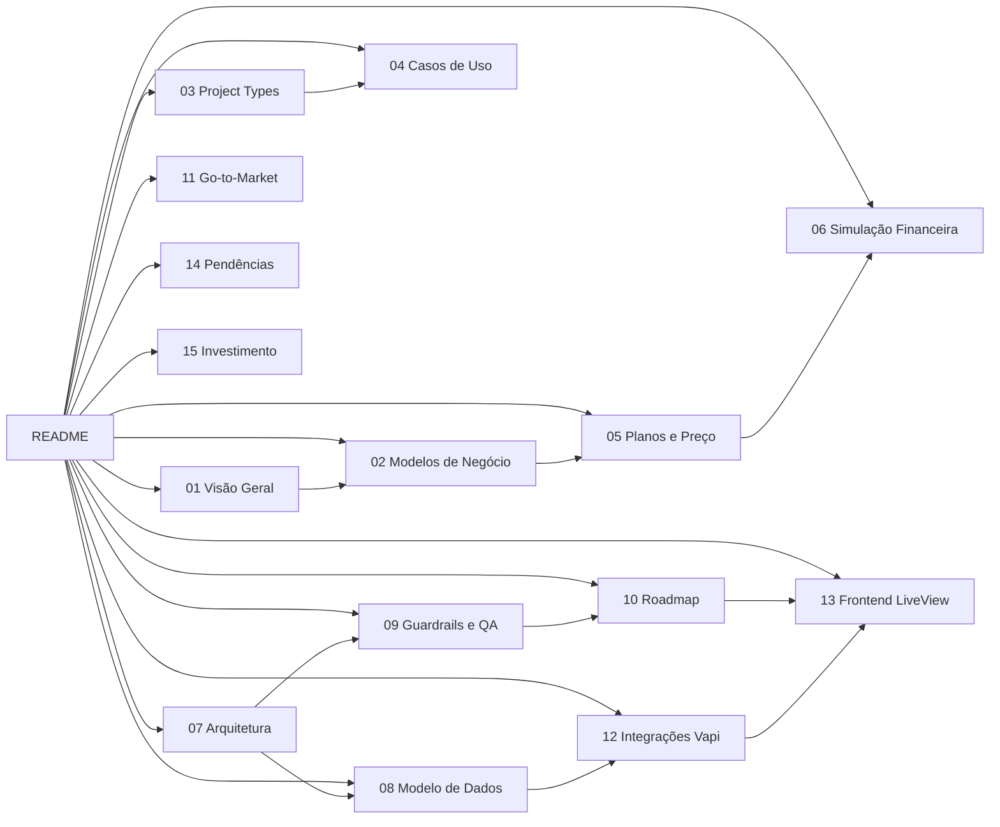

# 🚀 Plano de Negócio — Plataforma de Agentes de IA (Brasil)

> Infraestrutura modular para automação de voz e conversação multi-canal (voz, SMS, Telegram, web), construída com Elixir + Phoenix LiveView sobre a API da Vapi, com CRM omnichannel, GraphRAG, A/B testing, auto-tuning IA e compliance LGPD.

---

## 📚 Índice dos Documentos

| # | Documento | Descrição |
|---|-----------|-----------|
| 1 | [Visão Geral e Proposta de Valor](01_visao_geral.md) | O que é, para quem, posicionamento Brasil, diferencial competitivo |
| 2 | [Modelos de Negócio](02_modelos_negocio.md) | 10 modelos: Agência, Híbrido, Self-serve, White-label, Enterprise, BYOK, Marketplace, Verticalização, Performance, Managed |
| 3 | [Project Types e Templates](03_project_types.md) | 5 modos de agente, wizard, KPIs e templates por tipo |
| 4 | [Catálogo de Casos de Uso](04_casos_de_uso.md) | 14+ verticais: saúde, jurídico, imob, cobrança, outbound, franquias... |
| 5 | [Planos e Precificação](05_planos_precificacao.md) | 4 planos com 30+ features cada, 19 entitlements, add-ons |
| 6 | [Simulação Financeira](06_simulacao_financeira.md) | Unit economics, cenários conservador/agressivo, break-even |
| 7 | [Arquitetura Empresarial](07_arquitetura_empresarial.md) | 7 pilares, 52+ contexts, 28 workers, fluxos críticos |
| 8 | [Modelo de Dados (ERD)](08_modelo_dados.md) | 62 tabelas, 68 migrations, schemas detalhados |
| 9 | [Guardrails e QA](09_guardrails_qa.md) | Modo travado vs avançado, pipeline QA/Evals, deploy gates |
| 10 | [Roadmap Técnico](10_roadmap_tecnico.md) | 12 sprints em 3 fases, Elixir/Phoenix, ordem de construção |
| 11 | [Estratégia Go-to-Market](11_go_to_market.md) | ICP, aquisição, retenção, funil, parcerias |
| 12 | [Integrações e API Vapi](12_integracoes_vapi.md) | Endpoints, webhooks, payloads, structs Elixir |
| 13 | [Frontend LiveView](13_frontend_liveview.md) | 82 LiveViews, 90 rotas, 15 hooks, componentes, realtime |
| 14 | [**Pendências (Gap Analysis)**](14_pendencias.md) | O que falta implementar para produção completa |
| 15 | [**Investimento, Custos e Valoração**](15_investimento_custos.md) | Custos de desenvolvimento, valoração do projeto e ROI |

---

## 🗺️ Mapa de Navegação

---

## ⚡ Stack Tecnológica

| Camada | Tecnologia |
|--------|-----------|
| Backend | Elixir 1.18+ / Phoenix 1.7+ |
| Frontend | Phoenix LiveView (82 páginas) |
| Banco | PostgreSQL 16+ (62 tabelas) |
| Jobs | Oban (28 workers, 9 filas) |
| Cache/Rate | ETS (Hammer) |
| API Voz | Vapi |
| Telefonia BR | Twilio / Telnyx |
| SMS | Twilio |
| Bot | Telegram Bot API |
| LLMs | Gemini, OpenAI, Anthropic |
| Graph | GraphRAG (embeddings + entidades) |
| Criptografia | Cloak Ecto |
| Deploy | Fly.io + GitHub Actions |

---

## 📊 Métricas do Sistema

| Métrica | Valor |
|---------|-------|
| Arquivos `.ex` | **329** |
| Linhas de código | **52.323+** |
| LiveViews | **82** |
| Controllers | **15** |
| Workers Oban | **28** |
| Schemas Ecto | **62** |
| Migrations | **68** |
| Hooks JS | **15** |
| Audit Actions | **90+** |
| Webhook Events | **23** |
| Chat LLM Tools | **80+** |
| MCP Tools | **34** |
| Testes | **219 arquivos** |
| Rotas | **~90** |

---

## 🎯 Resumo Executivo

- **Mercado**: Brasil (expansão LATAM futuro)
- **Modelo**: Híbrido (Produto SaaS + Agência DFY)
- **Diferencial**: Multi-canal + GraphRAG + A/B Testing + Auto-Tuning + Guardrails + Observabilidade
- **Meta Ano 1**: 30–80 clientes, R$ 30k–80k MRR
- **Meta Ano 3**: 500+ clientes (diretos + indiretos), R$ 300k–800k MRR
- **Break-even**: 5–6 meses com 20 clientes ativos
# atende-ai
